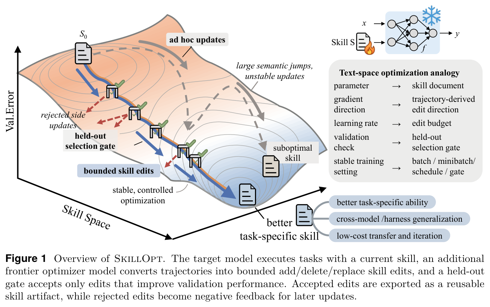
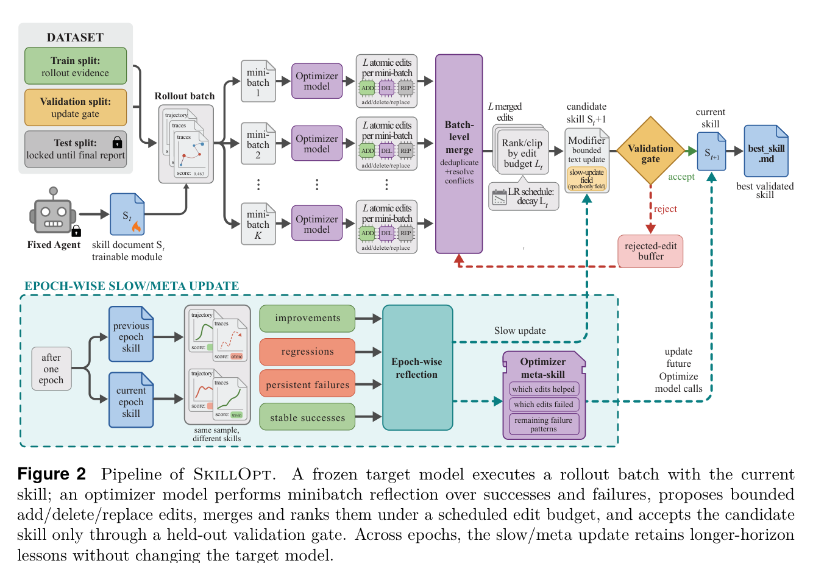
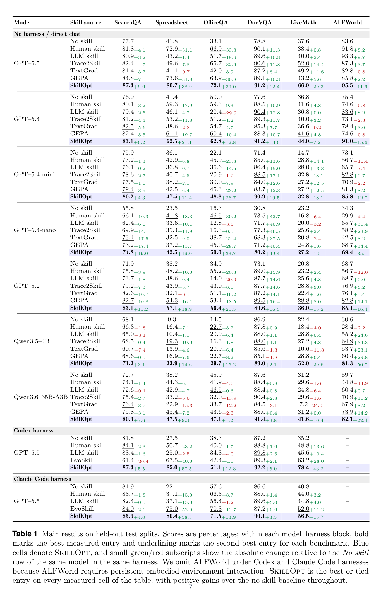
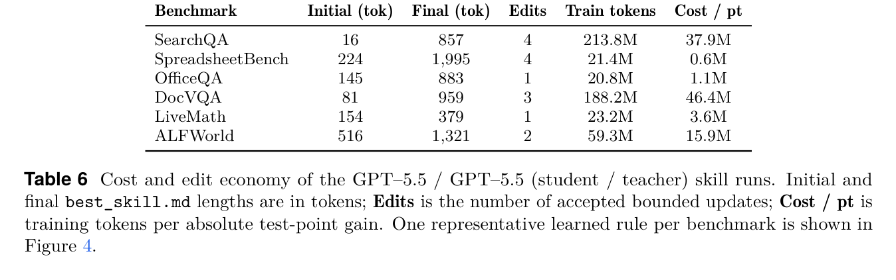
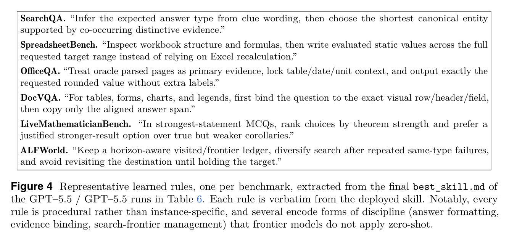

# 1. Introduction

---

**SkillOpt: Executive Strategy for Self-Evolving Agent Skills** (Microsoft, 2026)는 에이전트의 **스킬 문서(skill document)를 "학습 가능한 파라미터"로 취급**하고, 딥러닝 옵티마이저와 동일한 규율로 훈련시키는 방법을 제안합니다.

### 1. 배경 및 문제 제기

프론티어 모델은 이제 단일 프롬프트 호출자를 넘어 도구·파일·검증기를 갖춘 다단계 실행 하네스 안에서 동작합니다. 이런 환경에서 도메인 적응은 더 이상 모델 가중치나 프롬프트만의 문제가 아닙니다. **에이전트가 증거를 모으고, 도구를 부르고, 도메인 관례를 따르고, 출력을 포맷하는 "절차(procedure)" 자체를 개선해야 합니다.**

스킬(skill)은 바로 이 절차적 적응을 담는 자연어 아티팩트입니다. 문제는 지금까지 스킬이 만들어지는 방식입니다.

- **수작업 작성**: 전문가가 직접 쓰지만 타깃 도메인이나 하네스가 바뀌면 쉽게 깨집니다.
- **원샷 LLM 생성**: 태스크 설명만 보고 한 번에 뽑아내므로, 실제 롤아웃에서 관찰된 실패를 반영할 수 없습니다.
- **느슨한 자기 수정(self-revision)**: 에이전트가 스스로 스킬을 고쳐 쓰지만, **어떤 수정이 실제로 성능을 올렸는지 검증하는 절차가 없습니다.**

→ **셋 다 "옵티마이저처럼 동작하지 않습니다." 피드백을 받아도 시작점보다 확실히 나아진다는 보장이 없습니다.**

### 2. 제안: SkillOpt

논문의 핵심 아이디어는 한 문장으로 압축됩니다. **스킬 문서를 frozen 에이전트의 외부 상태(external state)로 보고, 가중치 최적화를 재현 가능하게 만든 바로 그 규율로 훈련시키자.**

구체적으로는 딥러닝 훈련 루프의 각 구성요소를 텍스트 공간에 1:1로 대응시킵니다. 위 Figure 1의 우측 상단 표가 이 대응 관계를 정리하고 있습니다.

| 딥러닝 | SkillOpt (텍스트 공간) |
| --- | --- |
| parameter (파라미터) | **skill document** — 훈련되는 대상 |
| gradient direction (그래디언트 방향) | **trajectory-derived edit direction** — 롤아웃에서 유도된 편집 방향 |
| learning rate (학습률) | **edit budget $L_t$** — 한 스텝에 허용되는 최대 편집 수 |
| validation check (검증) | **held-out selection gate** — 검증 점수가 오를 때만 편집을 수락 |
| stable training setting | batch / minibatch / schedule / gate |

Figure 1의 좌측 3D 손실 곡면이 이 논문의 직관을 잘 보여줍니다.

- **회색 점선(ad hoc updates)**: 기존의 무제한 자기 수정입니다. 한 번에 의미론적으로 크게 점프하기 때문에 곡면 위를 불안정하게 튕겨 다니다 **suboptimal skill**에 도달합니다.
- **파란 실선(bounded skill edits)**: SkillOpt입니다. 매 스텝 편집량을 제한하고(`bounded`), held-out 게이트(그림의 자물쇠 아이콘)를 통과한 편집만 수락합니다. 게이트를 통과하지 못한 **rejected side updates**(빨간 점선)는 버려지는 대신 **다음 스텝의 negative feedback으로 재활용**됩니다.
- 결과적으로 곡면을 안정적으로 미끄러져 내려가 더 나은 task-specific skill에 도달합니다.

> **왜 "bounded"가 결정적인가?**
> 연속된 스킬 리비전이 너무 멀리, 혹은 일관되지 않은 방향으로 움직이면 **거절된 편집과 이전에 수락된 편집이 더 이상 의미 있는 최적화 히스토리를 제공하지 못합니다.** 각 리비전이 직전 버전에 가깝게 머물러야만, 이후의 옵티마이저 호출이 "무엇이 도움이 되었고, 무엇이 실패했으며, 무엇을 보존해야 하는지"를 학습할 수 있습니다.

### 3. 핵심 결과

- 6개 벤치마크 × 7개 타깃 모델 × 3개 실행 하네스(direct chat, Codex, Claude Code)에서 평가한 **52개 (model, benchmark, harness) 셀 전부에서 최고 또는 동률 1위**를 기록했습니다.
- GPT–5.5 direct chat 기준 no-skill 대비 평균 **+23.5점**, Codex 루프 안에서 **+24.8점**, Claude Code 안에서 **+19.1점**.
- human-written / one-shot LLM / Trace2Skill / TextGrad / GEPA / EvoSkill 중 **셀마다 가장 강한 경쟁자만 골라 만든 오라클 베이스라인**보다도 평균 +5.4점 앞섭니다.
- 배포되는 산출물은 **300~2,000 토큰짜리 `best_skill.md` 파일 하나**입니다. 가중치 업데이트도, 추론 시점의 추가 모델 호출도 없습니다.

# 2. Method: 스킬을 "훈련"하는 루프

---

Figure 2는 SkillOpt의 전체 파이프라인입니다. 왼쪽에서 오른쪽으로 데이터 흐름을 따라가 보겠습니다.

**1. 데이터를 셋으로 나눈다 (좌측 상단, DATASET)**
- **Train**: 에이전트를 실제로 굴려서 "무엇이 잘 되고 무엇이 안 되는지" 증거를 모으는 용도
- **Validation**: 고친 스킬을 채택할지 말지 판정하는 용도 (오직 심판 역할)
- **Test**: 최종 성적표를 낼 때까지 열어보지 않음 (그림의 자물쇠)

→ 그래서 논문의 모든 점수는 **처음 보는 문제에서의 성능**입니다.

**2. 일단 시켜본다 (Fixed Agent → Rollout batch)**
현재 스킬을 붙인 채로 훈련 문제들을 풀게 합니다. 이때 답만 보는 게 아니라 **어떻게 풀었는지 과정 전체**(도구를 뭘 불렀는지, 뭘 관찰했는지, 최종 답, 채점 결과)를 기록합니다.

핵심은 아이콘 두 개입니다 — **모델에는 자물쇠🔒(안 건드림), 스킬 문서에는 불꽃🔥(이것만 학습됨).**

**3. 잘된 것/안된 것을 모아서 원인을 찾는다 (mini-batch → Optimizer model)**
결과를 성공 묶음과 실패 묶음으로 나눠, **스킬을 고쳐 쓰는 전담 모델(옵티마이저)** 에게 넘깁니다.

한 건씩 보지 않고 **여러 건을 묶어서(미니배치) 보는 게 포인트**입니다. 한 건만 보면 "이 문제에선 이렇게 했어야 했다" 같은 땜질이 나오지만, 묶어서 보면 *"얘는 계속 엉뚱한 데서 자료를 찾는다"*, *"답 형식을 매번 틀린다"* 같은 **반복되는 습관**이 보입니다. 옵티마이저는 여기서 **추가(add) / 삭제(delete) / 교체(replace)** 형태의 수정안을 냅니다.

**4. 수정안을 추리고, 몇 개만 남긴다 (merge → rank/clip)**
여러 묶음에서 나온 수정안을 합치면서 중복과 모순을 정리하고, 중요한 순서로 줄 세워 **상위 $L_t$개만 통과시킵니다.** 기본값은 4개(점점 줄어 최소 2개).

이 "**한 번에 4개까지만**"이 바로 **학습률**입니다. 제한이 없으면 멀쩡한 규칙을 지워버리거나, 앞뒤 안 맞는 지침을 끼워넣거나, 어쩌다 한 번 틀린 문제에 과하게 맞춰버리기 쉽습니다.

**5. 진짜 좋아졌는지 확인하고 통과시킨다 (Validation gate)**
수정된 스킬을 **같은 모델·같은 환경**으로 검증셋에서 다시 돌려봅니다. 점수가 **확실히 올랐을 때만** 채택하고, 같으면 거절합니다.

→ "고쳤으니 좋아졌겠지"가 아니라 **"고쳐보고 → 재보고 → 나아졌을 때만 반영"** 입니다. 옵티마이저의 진단이 그럴듯해 보여도 실제로는 성능을 깎는 경우가 많기 때문입니다.

**6. 거절된 수정도 버리지 않는다 (Rejected-edit buffer)**
탈락한 수정안은 "이걸 시도했더니 몇 점 떨어졌다"로 기록해두고, **같은 epoch의 다음 수정 때 참고 자료로 넣어줍니다.** 같은 실수를 반복하지 않고 아직 못 고친 문제에 집중하게 됩니다.

훈련 중에만 쓰이므로 **실제 배포될 스킬 파일은 전혀 무거워지지 않습니다.**

**7. epoch가 끝나면 길게 되돌아본다 (slow/meta update)**
3~6번이 "이번 배치에서 배우기"라면, 이건 **"지난 epoch과 이번 epoch을 비교해서 배우기"** 입니다. **같은 문제들을 이전 스킬과 현재 스킬로 각각 다시 풀려서** 결과를 네 종류로 분류합니다 — 좋아진 것 / 나빠진 것 / 계속 틀리는 것 / 계속 맞는 것.

여기서 나온 교훈이 두 군데로 갑니다.

- **Slow update** → 스킬 문서 안의 **보호 구역**에 장기 지침을 씁니다. 이 구역은 3~6번의 일반 수정이 **건드릴 수 없어서**, 급하게 고친 내용이 오래 쌓인 노하우를 덮어쓰는 사고를 막습니다. (물론 이것도 5번 게이트를 통과해야 합니다.)
- **Optimizer meta-skill** → "어떤 식의 수정이 먹혔고 어떤 게 헛발질이었나"를 **옵티마이저만 보는 메모**로 남깁니다. **배포되는 스킬 파일에는 안 들어갑니다.**

→ 결과적으로 **훈련은 풍부한 히스토리를 활용하면서, 최종 산출물은 가볍게 유지**됩니다. 딥러닝의 모멘텀처럼 안정적인 방향을 epoch을 가로질러 실어 나르는 역할입니다.

### 하네스 비종속성 (Harness-Agnostic Deployment)

SkillOpt는 경량 어댑터 인터페이스로 동작합니다. 어댑터는 훈련/평가 배치를 구성하고, 현재 스킬을 에이전트 컨텍스트에 주입하고, 네이티브 하네스를 실행해 채점된 궤적을 돌려줍니다.

- **Direct chat**: 스킬을 시스템 프롬프트에 prepend합니다.
- **Codex harness**: 워크스페이스 쓰기 가능 샌드박스에서 `codex` CLI를 구동하고, 스킬을 태스크별 `SKILL.md`로 렌더링합니다. 그리고 **`codex_trace_summary.txt`라는 압축 실행 트레이스를 다시 읽어 옵티마이저에게 넘깁니다.** 최종 답만이 아니라 **에이전트가 실제로 무엇을 했는지**로부터 학습한다는 뜻입니다.
- **Claude Code harness**: `claude` CLI를 통해 동일한 워크스페이스 계약을 따릅니다.

세 모드 모두 **같은 `best_skill.md` 포맷을 소비하며, 이것이 뒤에서 볼 cross-harness transfer 실험을 가능하게 합니다.**

# 3. 얼마나 좋아지는가: 52/52 셀 전승

---

**실험 설정**은 의도적으로 이질적입니다. 벤치마크 6개(SearchQA, SpreadsheetBench, OfficeQA, DocVQA, LiveMath, ALFWorld), 타깃 모델 7개(프론티어급 GPT–5.5부터 4B짜리 Qwen3.5까지), 베이스라인 7개(no skill, 전문가 작성, one-shot LLM, Trace2Skill, TextGrad, GEPA, EvoSkill).

Table 1이 이 논문의 핵심 결과 행렬입니다. 각 모델 블록의 마지막 **SkillOpt 행(연보라 셀)** 이 나머지 6개 베이스라인과 경쟁하며, 작은 초록/빨강 아래첨자는 같은 블록 **No skill 행 대비 절대 변화량**입니다.

**모든 셀에서 이깁니다.** 7개 모델 × 6개 벤치마크(direct chat) + Codex/Claude Code 하네스 각 5개, 총 **52개 셀 전부에서 최고 또는 동률**입니다. 게다가 셀마다 가장 강한 경쟁자만 골라 만든 **오라클 베이스라인보다도 평균 +5.4점** 앞섭니다.

**가중치를 안 건드리는 방법치고 이득이 비정상적으로 큽니다.** GPT–5.5 direct chat 6개 벤치마크 평균이 58.8 → **82.3 (+23.5점)**. 벤치마크별 편차가 의미심장합니다.

| 벤치마크 | No skill → SkillOpt | |
| --- | --- | --- |
| SearchQA | 77.7 → 87.3 | +9.6 (이미 천장에 가까움) |
| SpreadsheetBench | 41.8 → 80.7 | **+38.9** |
| OfficeQA | 33.1 → 72.1 | **+39.0** |
| LiveMath | 37.6 → 66.9 | +29.3 |

→ **엄격한 절차와 답변 포맷을 요구하는 벤치마크에서 이득이 압도적입니다. 정확히 zero-shot 프론티어 모델의 한계 지점이기 때문입니다.**

**작은 모델일수록 이득이 큽니다.** 모델당 평균 약 +17.6점인데, GPT–5.4-nano는 +26.7점으로 가장 큽니다(DocVQA 30.8 → 80.2, ALFWorld 34.3 → 69.4). **컴팩트한 스킬이, 작은 모델이 아직 가중치 안에 갖고 있지 못한 절차적 지식을 공급해준다**는 해석과 맞아떨어집니다.

**도구를 쓰는 실행 환경에서도 동일합니다.** Codex harness에서 GPT–5.5는 no skill 대비 **+24.8점**, Claude Code에서는 **+19.1점**. 특히 Codex SpreadsheetBench는 27.5 → 85.0으로 **+57.5점**입니다.

**한 번 만들어 여러 곳에 재사용됩니다(Table 4, 생략).** 최적화된 스킬은 태스크 전용 프롬프트가 아니라 이식 가능한 아티팩트입니다. **Codex에서 훈련한 SpreadsheetBench 스킬을 추가 최적화 없이 Claude Code에 그대로 얹으면 22.1 → 81.8 (+59.7점)** 으로, 그 환경에서 직접 최적화한 80.4를 오히려 넘어섭니다. 모델 규모를 건너뛰는 전이(GPT–5.4 → mini/nano)와 인접 벤치마크로의 전이(OlympiadBench → Omni-MATH)도 **전 행이 양수**입니다.

> 두 하네스는 서로 다른 도구/파일 API를 노출합니다. 그럼에도 전이된다는 것은, 학습된 규칙이 **환경별 커맨드 레시피가 아니라 "구조를 먼저 확인하라" 같은 도메인 절차**를 담고 있다는 뜻입니다. 한 곳에서 최적화한 비용을 관련된 배포 환경 전체에 분할 상환할 수 있습니다.

**성능의 실체는 통제 장치입니다(Table 3, 생략).** 배치 크기나 스케줄러 같은 하이퍼파라미터에는 놀랍도록 둔감하지만, 구조적 장치를 하나씩 빼면 무너집니다 — 편집 예산 제거 −1.8~−4.0점, 거절 버퍼 제거 −1.6~−4.6점, **slow/meta update 제거 시 SpreadsheetBench −22.5점**. 즉 이득의 원천은 리플렉션 자체가 아니라 **그것을 통제하는 장치들**입니다.

# 4. 그래서 나온 스킬 파일은 어떻게 생겼나

---

메서드가 작동한다는 것과, 그 산출물이 실제로 쓸 만하다는 것은 다른 문제입니다.

**작습니다.** 최종 `best_skill.md`는 379 토큰(LiveMath)~1,995 토큰(SpreadsheetBench), 중앙값 약 920 토큰. **현대 모델의 시스템 프롬프트 예산에 한참 못 미치는 크기라, 실무자가 몇 분 안에 읽고 검토하고 직접 고칠 수 있습니다.**

**그런데 편집은 겨우 1~4번입니다.** 이 표에서 가장 놀라운 열이 `Edits`입니다. 6개 벤치마크 전체에서 실제로 파일에 반영된 편집이 **1~4회(중앙값 2.5회)** 뿐입니다.

- LiveMath: **수락된 편집 단 1회**로 +29.3점
- OfficeQA: **수락된 편집 단 1회**로 +39.0점

→ **검증 게이트가 진짜로 일하고 있다는 직접적 증거입니다.** 옵티마이저는 epoch당 훨씬 많은 수정안을 내지만 대부분 탈락하고, 나머지는 거절 버퍼에 남을 뿐 타깃 모델에는 도달하지 않습니다. **최종 스킬은 "모든 반성의 합집합"이 아니라 그중 살아남은 극소수입니다.**

**비용은 훈련 때 한 번만 냅니다.** 테스트 점수 1점당 0.6M(SpreadsheetBench)~46.4M(DocVQA) 토큰이 들었고, 흥미롭게도 **이득이 가장 큰 벤치마크가 동시에 가장 쌉니다**(OfficeQA는 총 20.8M 토큰으로 +39.0점). export 이후에는 옵티마이저 호출도 가중치 업데이트도 없이 텍스트 파일 하나만 추가됩니다.

## 학습된 규칙은 실제로 어떤 모습인가

Figure 4는 벤치마크별 최종 `best_skill.md`에서 **원문 그대로** 뽑은 대표 규칙입니다.

**특정 문제가 아니라 절차를 말합니다.** 여섯 규칙 중 어느 것도 특정 질문·파일·엔티티를 지명하지 않습니다.
- *SpreadsheetBench*: "워크북 구조와 수식을 검사한 다음, Excel 재계산에 의존하는 대신 요청된 타깃 범위 전체에 **평가된 정적 값을 써라**."
- *DocVQA*: "표·양식·차트에서는 먼저 질문을 정확한 시각적 행/헤더/필드에 결속시킨 다음, **정렬된 답변 스팬만 복사하라**."
- *ALFWorld*: "방문한 곳을 기록해두고, 같은 유형의 실패가 반복되면 탐색을 다변화하며, 타깃을 손에 넣기 전에는 목적지를 재방문하지 마라."

**모델이 zero-shot으로 갖추지 못한 "규율"을 채웁니다** — 답변 포맷 지키기, 증거를 정확한 위치에 결속하기, 구조부터 확인하기, 탐색 이력 관리하기. 전부 똑똑함의 문제가 아니라 **습관의 문제**입니다.

**사람이 하루 써보고 쓸 법한 규칙처럼 읽힙니다.** 차이는 이것이 자동 생성되었고, held-out 데이터에서 **편집 하나하나가 검증되었다**는 점입니다.

### 실제 진화 사례: SpreadsheetBench

초기 스킬은 이미 "Python 스프레드시트 라이브러리를 쓰고 무관한 내용은 보존하라"고 말하고 있었습니다. 수락된 편집들은 이 일반적인 자동화 지침을 **워크북 포렌식 정책**으로 바꿔놓습니다.

- 프리뷰 말고 실제 워크북을 열어 확인하고, 여러 시트에 걸쳐 헤더와 타깃 범위를 찾고, 키와 셀 타입을 정규화하라.
- **핵심 규칙**: 채점기가 셀 값을 읽으므로, 프롬프트에 `INDEX/MATCH`나 `XLOOKUP` 같은 수식이 언급돼도 **수식이 아니라 계산된 값을 써 넣어야 한다.**
- 저장한 워크북을 다시 열어 경계 행과 빈 셀이 남았는지 확인하라.

→ 이 실행에서 held-out 성능은 **40.4 → 78.9**가 되었습니다. 초기 스킬을 갈아엎은 게 아니라, **반복 관찰된 실패 지점에 제약을 덧붙인 결과**입니다.

# 5. 정리

---

SkillOpt의 기여는 "스킬을 잘 만드는 또 하나의 방법"이 아니라, **스킬 개선을 ad hoc 프롬프트 수정에서 통제된 학습 과정으로 바꾼 것**입니다.

- **분리(separation)**: 태스크를 실행하는 타깃 모델과 스킬을 편집하는 옵티마이저 모델을 분리합니다. 옵티마이저는 오프라인 훈련에만 존재하므로 배포 비용이 0입니다.
- **통제(control)**: 유계 편집 예산(learning rate), 미니배치 리플렉션, held-out 검증 게이트, 거절 편집 버퍼, epoch 단위 slow/meta 업데이트 — 가중치 최적화를 재현 가능하게 만든 장치들을 텍스트 공간에 이식합니다.
- **결과**: 52/52 셀 최고 또는 동률, GPT–5.5 기준 direct chat +23.5 / Codex +24.8 / Claude Code +19.1점, 최강 per-cell 베이스라인 대비 +5.4점.
- **산출물**: 2,000 토큰 미만, 수락 편집 1~4회로 조립된 검사 가능한 텍스트 파일 하나. 모델 규모·하네스·인접 벤치마크를 가로질러 전이됩니다.

> **실무적 함의**: 스킬을 한 번 최적화하고, 텍스트로 감사하고, 모델 가중치를 바꾸지 않은 채 관련 모델·하네스·태스크에 재사용할 수 있습니다. Ablation이 그 이유를 설명합니다 — 유계 텍스트 학습이 무제한 재작성을 이기고, held-out 게이팅이 해로운 제안의 누적을 막고, 거절 버퍼가 실패한 편집을 negative feedback으로 바꾸고, slow/meta 업데이트가 배포 스킬을 부풀리지 않으면서 장기 지평 정제를 개선합니다.
