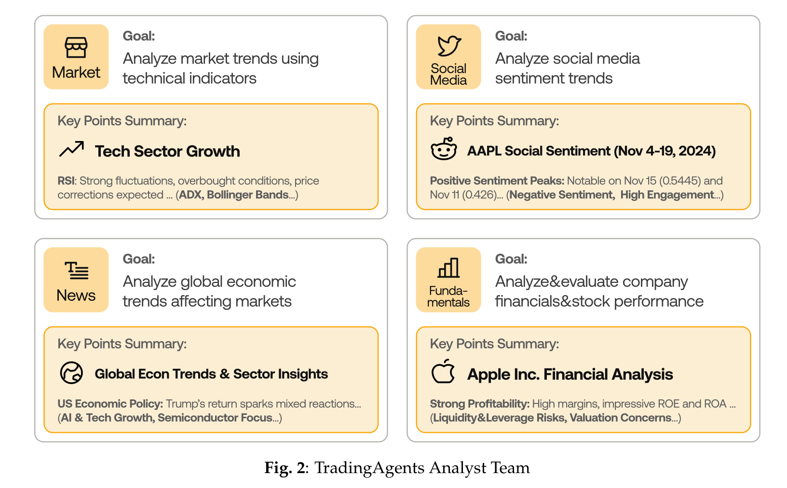
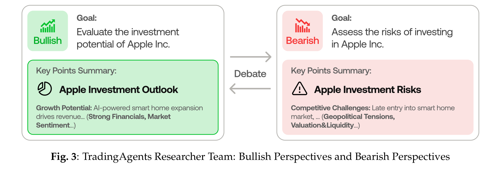
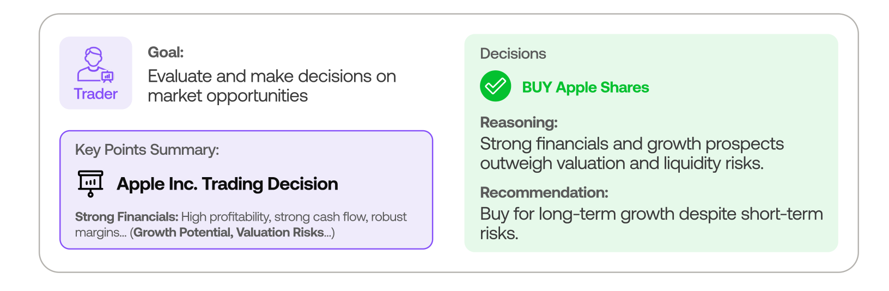
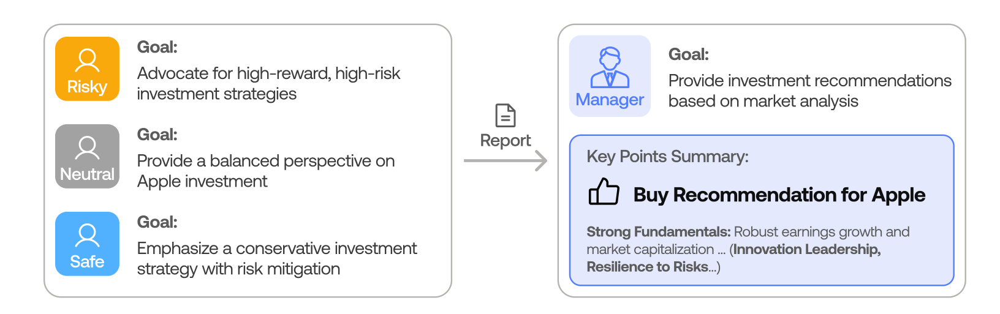
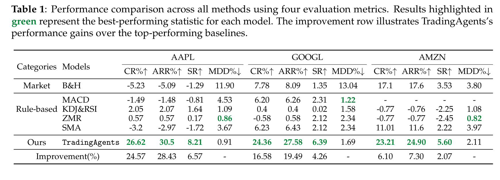
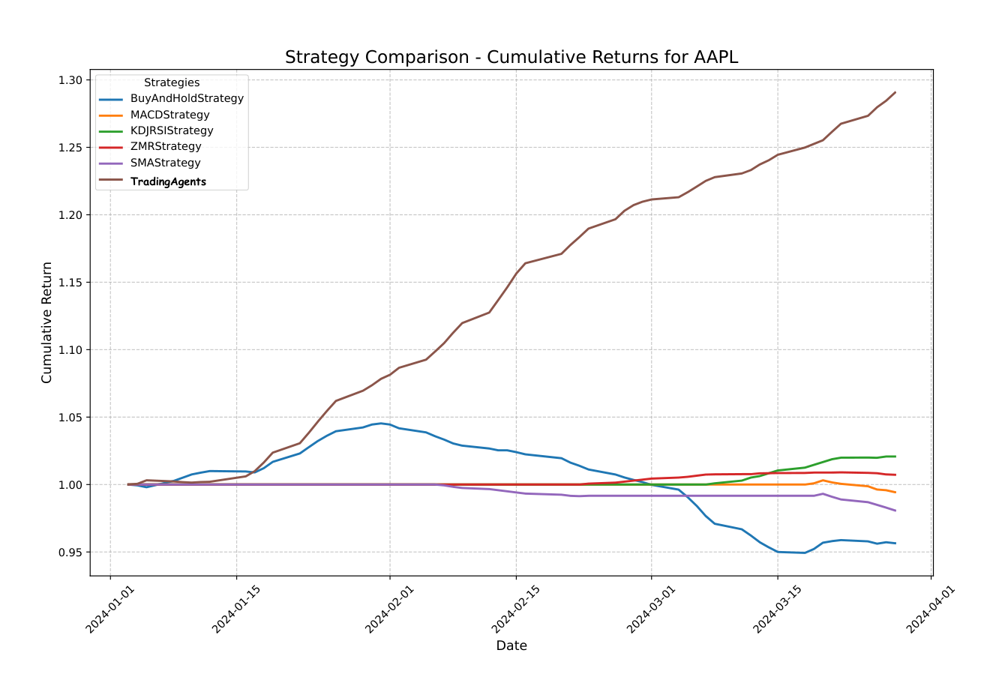
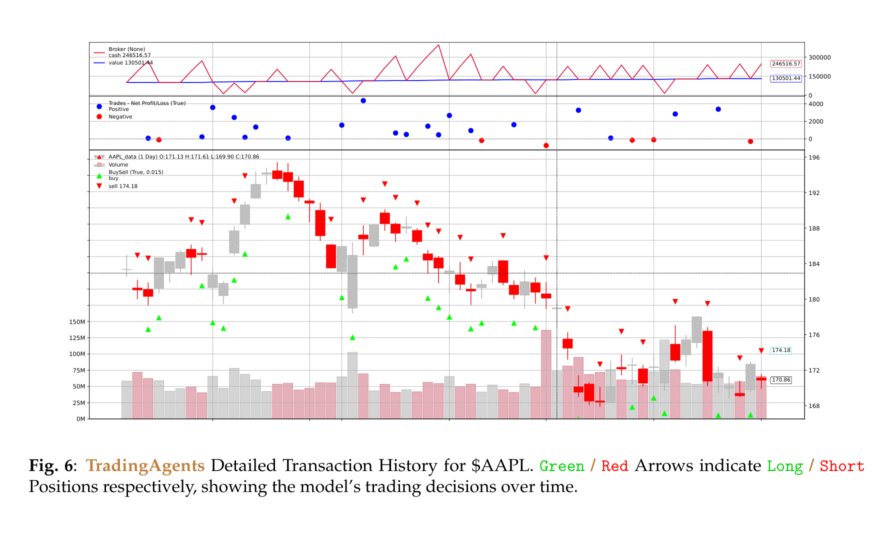

# 1. Introduction

---

### 1. 배경 및 문제 제기: 왜 LLM 트레이딩이 어려운가

금융 트레이딩은 **여러 종류의 신호를 동시에 다뤄야 하는 복잡한 의사결정 문제**입니다. 가격 차트, 재무제표, 뉴스, 소셜 미디어 감성, 거시경제 지표가 모두 얽혀 있고, 어느 하나만으로는 제대로 된 매매 판단이 나오지 않습니다. 실제 트레이딩 회사들은 이 문제를 **전문가 팀의 분업과 토론**으로 해결합니다 — 펀더멘털 애널리스트, 퀀트, 기술분석가, 트레이더, 리스크 매니저가 각자 역할을 맡고 회의에서 의견을 주고받습니다.

LLM을 트레이딩에 적용하려는 기존 연구들도 이 방향을 시도했지만, 두 가지 한계에 부딪혔습니다:

- **현실적인 조직 모델링의 부재 (Lack of Realistic Organizational Modeling):** 대부분의 프레임워크는 단일 에이전트 또는 느슨하게 묶인 다중 에이전트로, **실제 트레이딩 회사의 분업 구조와 의사결정 흐름**을 반영하지 못합니다. 결과적으로 특정 태스크에서만 잘 동작하고, 종합 판단 품질이 낮습니다.
- **비효율적인 통신 인터페이스 (Inefficient Communication Interface):** 에이전트 간 통신을 자유로운 자연어 대화로만 처리하면, 대화가 길어질수록 **"전화 게임 효과"** 가 발생합니다. 초기 정보가 왜곡되거나 누락되고, 컨텍스트 한계를 초과해 중요한 디테일이 사라집니다.

  → **"여러 에이전트를 그냥 모아놓고 자유롭게 대화시키는 것"으로는 전문 트레이딩 회사 수준의 의사결정을 흉내낼 수 없습니다.**

### 2. 제안: TradingAgents — 트레이딩 회사를 통째로 시뮬레이션하다

**TradingAgents**의 아이디어는 명료합니다:

1. **실제 트레이딩 회사의 조직도를 그대로 LLM 에이전트로 옮긴다.** 7개의 전문 역할 — 펀더멘털/감성/뉴스/기술 애널리스트, 강세/약세 리서처, 트레이더, 리스크 매니저 — 을 정의하고 각자에게 명확한 목표/도구/제약을 부여합니다.
2. **의사결정 파이프라인을 5단계로 고정한다.** Analyst Team → Researcher Team(찬반 토론) → Trader → Risk Management Team(보수/공격/중립 토론) → Fund Manager 순서로 정보가 흐르며, 각 단계는 다음 단계로 **구조화된 보고서**를 넘깁니다.
3. **자연어 대화 + 구조화된 통신을 혼합한다.** 토론이 필요한 곳(찬반 리서처, 리스크 팀)에서는 자연어 라운드를 돌리되, 에이전트 간 정보 전달은 **structured report**로 기록하여 정보 손실을 막습니다.

→ **"에이전트 사이의 자유 토론"과 "구조화된 보고서 전달"을 단계별로 구분한 것이 TradingAgents의 핵심입니다. 자연어의 유연함을 살리되, 단계 간에는 정보가 압축·정제된 채로 흘러갑니다.**

### 3. 핵심 결과

- **백테스팅 (2024년 1~3월, AAPL/GOOGL/AMZN):** 최소 **23.21% 누적 수익률**, 최고 26.62%
- **베이스라인 대비:** Buy-and-Hold, MACD, KDJ&RSI, ZMR, SMA 등 5개 룰베이스 전략을 모두 능가. 평균 **+6.1% 누적 수익**
- **Sharpe Ratio:** 모든 종목에서 베이스라인을 상회. AAPL에서 SR=8.21로 매우 높은 위험조정 수익
- **Maximum Drawdown:** 룰베이스보다 약간 높지만 절대값 2 이내로 통제. 리스크 토론 팀의 효과
- **설명 가능성 (Explainability):** 의사결정 과정의 모든 추론, 도구 호출, 토론 로그가 자연어로 기록되어 **사후 디버깅과 인간 감독**이 가능

# 2. TradingAgents: 전체 프레임워크

---

TradingAgents의 전체 구조는 아래 그림 한 장에 압축되어 있습니다.

**프레임워크는 5개의 단계를 따라 정보가 좌에서 우로 흘러갑니다:**

1. **데이터 수집 (좌측 회색 컬럼):** Yahoo Finance, X(Twitter), Reddit, Bloomberg, FinHub, Reuters, EODHD 같은 외부 소스에서 원시 데이터를 가져옵니다. 이는 시장 가격, 소셜 미디어, 뉴스, 그리고 회사 재무제표/내부자 거래 등 **4가지 카테고리**로 정리됩니다.

2. **Researcher Team (주황색 박스, Bullish/Bearish):** Analyst Team이 작성한 보고서를 받아, **강세 리서처와 약세 리서처가 토론**합니다. 강세는 매수 근거(Buy Evidence)를, 약세는 매도 근거(Sell Evidence)를 제시합니다. 토론은 최대 $n$ 라운드까지 진행되며, 각 라운드마다 상대방의 주장에 반박하거나 보강합니다.

3. **Trader (보라색 인물 아이콘):** 양측의 토론 결과와 근거를 종합하여 **거래 제안(Transaction Proposal)** 을 생성합니다. 단순히 "매수/매도/홀드"가 아니라, 그 근거와 예상 시나리오를 함께 출력합니다. 이 단계에서는 OpenAI o1 같은 **deep-thinking 모델**을 사용해 신중한 추론을 합니다.

4. **Risk Management Team (우측 상단 보라색 박스):** 트레이더의 제안을 받아, **세 가지 리스크 성향(Aggressive / Neutral / Conservative)** 의 에이전트가 다시 토론합니다. 각자의 시각에서 제안의 위험성을 평가하고, 필요하면 포지션 크기나 손절 전략을 조정합니다.

5. **Fund Manager (우측 인물 아이콘):** 리스크 토론을 검토하여 최종 의사결정을 내리고, 주문을 **Execution(실행)** 으로 보냅니다. 펀드 매니저는 모든 토론을 종합하는 최상위 의사결정자 역할을 합니다.

> **핵심 포인트:** 각 단계는 독립적으로 동작하며, 다음 단계에 **자신의 분석 결과만 구조화된 보고서로 넘깁니다.** 다음 단계 에이전트는 이전 모든 자연어 대화를 다시 읽을 필요가 없습니다. 이것이 "전화 게임 효과"를 막는 핵심 메커니즘입니다.

# 3. Role Specialization: 7개의 전문 에이전트

---

TradingAgents는 실제 트레이딩 회사의 직무를 모사하여 **7개의 명확한 역할**을 정의합니다. 각 역할은 자신만의 도구(tool)와 컨텍스트, 출력 형식을 가집니다.

## 3.1 Analyst Team — 4명의 전문 분석가

가장 먼저 동작하는 팀입니다. 시장의 다양한 측면을 동시에 분석합니다.

위 그림은 4명의 애널리스트가 각자 어떤 일을 하는지 보여주는 예시입니다 (Apple Inc. 분석 시점). 각 애널리스트는 **Goal(목표)** 과 **Key Points Summary(핵심 발견)** 의 2가지를 출력합니다:

- **Market Analyst (좌상단):** 기술적 지표(RSI, ADX, Bollinger Bands)를 사용해 시장 트렌드를 분석합니다. 예시 출력에서는 "Tech Sector Growth"와 "강한 변동성, 과매수 구간, 가격 조정 예상"을 보고합니다.
- **Social Media Analyst (우상단):** Reddit, X 등에서 종목별 감성 점수를 추적합니다. 11월 4~19일 AAPL 감성 피크를 11월 15일(0.5445), 11월 11일(0.426)로 식별합니다.
- **News Analyst (좌하단):** Bloomberg, Reuters, EODHD에서 거시 경제 트렌드와 지정학적 이슈를 추적합니다. 예시에서는 "트럼프 재선이 가져온 시장 반응", "AI/반도체 섹터 집중"을 보고합니다.
- **Fundamentals Analyst (우하단):** 재무제표, 실적 보고서, 내부자 거래를 분석하여 회사의 본질적 가치를 평가합니다. "강한 수익성, 높은 ROE/ROA"와 함께 "유동성/레버리지 위험, 밸류에이션 우려"를 동시에 보고합니다.

> **왜 4명을 따로 두는가?** 하나의 에이전트에게 "이 종목을 종합적으로 분석해라"라고 시키면, LLM은 모든 측면을 얕게 다룹니다. **역할을 분리하면 각 영역을 깊게 파고들 수 있고**, 도구도 영역별로 특화할 수 있습니다 (예: News Analyst는 EODHD/Finnhub API만, Technical Analyst는 코드 실행과 60개 기술지표 계산기만).

각 애널리스트는 quick-thinking 모델(`gpt-4o-mini`, `gpt-4o`)을 사용해 데이터 수집과 요약을 빠르게 처리합니다.

## 3.2 Researcher Team — 강세 vs 약세 토론

Analyst Team의 4개 보고서가 모이면, **Researcher Team**이 그것을 비판적으로 평가합니다.

이 팀은 정확히 두 명으로 구성됩니다:

- **Bullish Researcher (좌측 녹색):** 투자 기회를 옹호합니다. 긍정적 지표, 성장 가능성, 우호적 시장 조건을 강조합니다. 예시에서는 "AI 기반 스마트홈 확장이 매출 성장 동력", "강한 재무제표와 시장 감성"을 근거로 매수를 주장합니다.
- **Bearish Researcher (우측 빨간색):** 반대로 잠재적 하방 리스크를 강조합니다. "스마트홈 시장 진입 지연", "지정학적 긴장, 밸류에이션과 유동성 우려"를 근거로 위험을 경고합니다.

두 리서처는 가운데의 **Debate(토론)** 화살표를 따라 $n$ 라운드의 대화를 주고받습니다. 각 라운드에서 상대방의 주장에 반박하거나, 새로운 근거를 추가합니다. 마지막 라운드 후에는 **debate facilitator**(중재 에이전트)가 토론 기록을 검토하여 우세한 입장을 선택하고, 그 결과를 구조화된 엔트리로 다음 단계에 전달합니다.

> **이 단계의 핵심은 "동일한 데이터에서 정반대 해석이 나올 수 있다"는 점을 명시적으로 다룬다는 것입니다.** LLM은 종종 한쪽 입장에 빠르게 동조하는 경향이 있는데, 두 에이전트가 서로 다른 페르소나로 대립하면 **확증 편향**을 줄일 수 있습니다. 이 토론 기반 접근은 Du et al. (2023)의 multi-agent debate 방식에서 영감을 받았습니다.

리서처들은 deep-thinking 모델(`o1-preview`)을 사용해 다단계 추론을 수행합니다.

## 3.3 Trader Agent — 최종 매매 결정

Researcher Team의 토론 결과가 정리되면, **Trader Agent**가 실제 거래 의사결정을 내립니다.

위 예시에서 트레이더는 Apple Inc.에 대해:

- **Goal:** 시장 기회를 평가하고 의사결정을 내림
- **Key Points Summary:** "Apple Inc. Trading Decision — 강한 재무, 높은 수익성, 강한 현금흐름, 견고한 마진" (괄호 안에 "성장 잠재력, 밸류에이션 위험" 같은 양면성을 함께 기록)
- **Decision:** **BUY Apple Shares** (녹색 체크)
- **Reasoning:** "강한 펀더멘털과 성장 전망이 밸류에이션과 유동성 위험을 능가"
- **Recommendation:** "단기 위험에도 불구하고 장기 성장을 위한 매수"

트레이더의 책임은:

1. 애널리스트와 리서처의 권고를 평가
2. 거래의 **타이밍과 사이즈**를 결정 (단순 신호가 아닌 포지션 크기까지)
3. 매수/매도 주문 실행
4. 새 정보에 따라 포트폴리오 조정

> 트레이더는 단일 에이전트지만 deep-thinking 모델(o1-preview)을 사용해 **수많은 신호를 종합한 다단계 추론**을 수행합니다. 출력에는 항상 "결정 + 이유 + 권고" 3요소가 함께 들어가, 다음 단계인 리스크 팀이 검토할 수 있는 구체적 근거가 됩니다.

## 3.4 Risk Management Team — 3가지 시각의 리스크 토론

트레이더의 결정이 끝이 아닙니다. **Risk Management Team**이 다시 한 번 검토합니다.

이 팀은 세 가지 서로 다른 위험 성향의 에이전트로 구성됩니다:

- **Risky (공격적):** 고위험-고수익 전략을 옹호합니다. 트레이더의 결정이 너무 보수적이면 포지션 크기를 늘리자고 주장합니다.
- **Neutral (중립):** 균형 잡힌 시각을 제공합니다. 양 극단의 의견을 조정합니다.
- **Safe (보수적):** 위험 완화를 강조하며 보수적인 투자 전략을 옹호합니다. 손절 강화, 분산 투자 등을 제안합니다.

세 에이전트는 트레이더의 제안을 두고 자연어 토론을 벌이며, 각자의 위험 성향에 맞게 거래 계획을 조정하려 합니다. 토론이 끝나면 **Manager(우측 펀드 매니저)** 가 보고서를 받아 **최종 결정**을 내립니다. 예시에서는 "Buy Recommendation for Apple"이라는 매수 권고가 채택되었습니다.

> **왜 한 명의 리스크 매니저가 아니라 세 명을 두는가?** 단일 에이전트는 자신의 페르소나에 일관되게 행동하기 어렵고, "균형 잡힌 평가"라는 모호한 지시는 LLM이 잘 따르지 못합니다. **세 가지 명확한 입장을 분리하면 각 위험 시각이 충실히 표현되고**, 최종 결정자(펀드 매니저)는 이 세 입장을 비교하며 결정을 내릴 수 있습니다. 이는 실제 트레이딩 회사의 리스크 위원회 구조와 유사합니다.

이 단계 덕분에 TradingAgents는 베이스라인 대비 **MDD(Maximum Drawdown)를 2 이내로 통제**하면서도 높은 수익을 달성합니다.

# 4. Communication Protocol: 구조화된 메시지로 전화 게임 막기

---

TradingAgents의 또 다른 핵심 기여는 **에이전트 간 통신 프로토콜**입니다.

기존 다중 에이전트 프레임워크의 가장 큰 문제는 **자연어 대화에 모든 정보를 담는 것**입니다. 대화가 길어지면 컨텍스트 길이가 부풀어오르고, 초기 정보가 묻히거나 왜곡되며, 중요한 디테일이 소실됩니다 (이른바 "telephone effect"). TradingAgents는 MetaGPT의 구조화된 통신 패러다임에서 영감을 받아, **두 가지 통신 모드를 명확히 구분**합니다:

| 통신 모드 | 사용 시점 | 형식 |
|---|---|---|
| **Structured Report** | 단계 간 정보 전달 | JSON-like 구조화된 보고서 (Goal, Key Points, Reasoning) |
| **Natural Language Dialogue** | 같은 단계 내 토론 (Bull/Bear, Risk Team) | 자유 자연어, $n$ 라운드 제한 |

**구체적인 흐름:**

- **I. Analyst Team:** 각 애널리스트는 자신의 영역에 대한 **간결한 분석 보고서**를 작성합니다. 자연어 대화는 없습니다.
- **II. Researcher Team:** Bullish/Bearish가 자연어로 토론하지만, **각 토론 라운드는 facilitator가 구조화된 엔트리로 요약**하여 저장합니다. 다음 단계에는 토론 원본이 아니라 facilitator의 요약이 전달됩니다.
- **III. Trader:** 애널리스트 보고서들과 리서처 요약을 입력으로 받아, **결정 + 이유 + 권고**의 3요소 구조화 출력을 생성합니다.
- **IV. Risk Management Team:** Risky/Neutral/Safe가 트레이더의 결정을 두고 자연어로 토론하지만, 마찬가지로 **facilitator가 라운드를 구조화 엔트리로 정리**합니다.
- **V. Fund Manager:** 리스크 토론 요약을 검토하여 **최종 결정**을 내리고 거래를 승인합니다.

**모든 에이전트는 ReAct 프롬프팅 패턴을 따릅니다.** 추론(Reasoning) — 행동(Action) — 관찰(Observation)을 반복하며, 도구 호출과 사고 과정이 모두 로그에 남습니다. 이 환경 상태는 모든 에이전트 간에 공유되어, 누가 어떤 데이터를 어떻게 사용했는지 추적 가능합니다.

> **결과적으로, 자연어의 유연성(토론에서 새 아이디어 발견)과 구조화된 통신의 안정성(정보 손실 방지)을 모두 얻습니다.** 단순한 multi-agent dialogue 대비 통신 효율은 훨씬 높고, 단순한 structured-only 대비 추론 다양성은 더 풍부합니다.

## 4.1 Backbone LLM 선택 전략

TradingAgents는 **태스크 복잡도에 따라 LLM을 차등 선택**합니다:

- **Quick-thinking 모델 (`gpt-4o-mini`, `gpt-4o`):** 데이터 검색, 요약, API 호출, 표 → 텍스트 변환 등 빠르고 얕은 작업
- **Deep-thinking 모델 (`o1-preview`):** 의사결정, 리서처 토론, 트레이더 추론, 리스크 평가 등 다단계 추론이 필요한 작업

→ **LLM 비용을 최소화하면서도 핵심 의사결정 단계의 품질은 최대한으로 유지하는 전략입니다.** 더불어 모델은 모듈식으로 교체 가능하여, 향후 더 나은 추론 모델이나 finance-tuned 모델이 나오면 즉시 적용할 수 있습니다. GPU도 필요 없고 API 크레딧만으로 동작합니다.

# 5. Experiments

---

## 5.1 실험 설정

- **기간:** 2024년 1월 1일 ~ 3월 29일 (약 3개월 백테스팅)
- **종목:** Apple (AAPL), Nvidia (NVDA), Microsoft (MSFT), Meta (META), Google (GOOGL) 등 주요 빅테크
- **데이터:** 가격(OHLCV), 60개 기술 지표, 뉴스(Bloomberg/Yahoo/EODHD/Reddit), 소셜 미디어 감성, 내부자 거래, 분기/연간 재무 보고서
- **Look-ahead bias 제거:** 매 거래일마다 그 시점까지의 데이터만 사용
- **지표:** Cumulative Return (CR), Annualized Return (AR), Sharpe Ratio (SR), Maximum Drawdown (MDD)
- **베이스라인:** Buy-and-Hold, MACD, KDJ&RSI, ZMR (Zero Mean Reversion), SMA

> **3개월이라는 짧은 백테스팅 기간**의 이유는 LLM 비용입니다. 매 예측마다 11회의 LLM 호출과 20회 이상의 도구 호출이 발생하므로, 더 긴 기간을 시뮬레이션하면 비용이 폭발합니다. 저자들은 향후 LLM 추론을 최적화하여 더 긴 백테스팅을 진행할 계획이라고 명시합니다.

## 5.2 종합 성능 비교

위 표는 AAPL, GOOGL, AMZN 세 종목에 대한 모든 베이스라인과 TradingAgents의 성능 비교입니다.

**핵심 결과:**

- **AAPL:** TradingAgents는 **CR 26.62%, AR 30.5%, SR 8.21**을 달성. 가장 좋은 베이스라인(KDJ&RSI: CR 2.05%) 대비 압도적으로 우월합니다. AAPL은 테스트 기간 동안 시장 변동성이 컸고 룰베이스 전략들이 제대로 동작하지 못한 도전적인 종목인데, TradingAgents는 이 환경에서도 26% 이상의 수익을 냈습니다.
- **GOOGL:** **CR 24.36%, SR 6.39**. 두 번째로 좋은 베이스라인 대비 +16.58% 개선.
- **AMZN:** **CR 23.21%, SR 5.60**. Buy-and-Hold(CR 17.1%)를 +6.10% 차이로 능가.
- **MDD (위험):** TradingAgents의 MDD는 0.91~2.11 범위로, 룰베이스 전략들의 일부 종목 MDD(0.82~1.22)보다는 약간 높지만 절대값 자체는 매우 작게 통제됩니다. **수익률을 25%까지 높이면서도 drawdown을 2 이내로 막는 것**은 보통의 트레이딩 시스템에서는 매우 어려운 균형입니다.

> **💡 핵심 통찰:** Buy-and-Hold조차 일부 종목(AAPL: -5.23%)에서는 손실을 봤습니다. 즉 테스트 기간이 단순한 상승장이 아니었다는 뜻이고, TradingAgents의 +20% 수익률은 단순한 시장 베타가 아닌 **알파(초과수익)** 입니다.

## 5.3 AAPL 누적 수익률 곡선

위 그래프는 AAPL 종목에 대한 누적 수익률을 시각화한 것입니다.

- **갈색 곡선 (TradingAgents):** 시작부터 끝까지 거의 단조 증가하며, 3월 말에는 약 **1.30 (즉 +30%)** 에 도달합니다.
- **파란색 (Buy-and-Hold):** 1월 말까지는 조금 올랐지만, 2월 중순 이후 계속 하락하여 종가는 출발점 아래입니다.
- **나머지 룰베이스 (MACD, KDJ&RSI, ZMR, SMA):** 거의 1.0 근처에 머물거나 약간의 변동만 보입니다.

특히 주목할 점은 **TradingAgents 곡선의 매끄러움**입니다. 큰 변동성 없이 꾸준히 상승하는데, 이는 리스크 매니지먼트 팀이 작동하여 큰 손실을 낼만한 포지션을 사전에 차단했기 때문으로 해석됩니다.

→ **단순히 "운 좋게 수익을 낸 것"이 아니라, 리스크가 통제된 상태에서 지속적으로 알파를 만들어냈다는 증거입니다.**

## 5.4 거래 의사결정 시각화

이 차트는 TradingAgents가 AAPL에 대해 내린 모든 매매 결정을 시간순으로 시각화한 것입니다.

- **상단 패널:** 브로커 잔고와 포트폴리오 가치 곡선 (빨간색이 가치, 파란색이 잔고)
- **중간 패널:** 거래의 손익 분포 (파란 점은 수익 거래, 빨간 점은 손실 거래)
- **하단 패널 (메인):** AAPL의 캔들 차트 위에 매매 결정이 표시됨
  - **녹색 ▲:** Long(매수) 진입
  - **빨간 ▼:** Short(매도) 진입
- **최하단:** 거래량 막대그래프 (회색/빨간색)

차트를 보면 TradingAgents는 단순히 한 방향으로만 베팅하지 않습니다. **상승 추세가 약해지면 매도(▼) 신호를, 하락 후 반등 시점에는 매수(▲) 신호를 내며 양방향 트레이딩**을 합니다. 특히 2월 중순의 큰 하락 구간에서도 적절한 시점에 short 포지션을 잡아 손실을 회피하고, 일부는 수익으로 전환했음을 볼 수 있습니다.

> **이 시각화는 TradingAgents의 가장 큰 장점인 "설명 가능성"을 잘 보여줍니다.** 모든 매매 결정에는 그 시점의 분석 보고서, 토론 기록, 리스크 평가가 자연어로 남아있어, 사후에 "왜 이때 매수했는지"를 정확히 추적할 수 있습니다. 이는 블랙박스로 동작하는 딥러닝 트레이딩 모델에 비해 결정적인 운영상 이점입니다.

## 5.5 Sharpe Ratio와 Drawdown — 위험조정 수익의 관점

논문은 Sharpe Ratio가 비정상적으로 높게 나온 것에 대해 명시적으로 언급합니다 (AAPL에서 SR=8.21, 일반적으로 SR > 3이면 "excellent"로 간주). 저자들은 이를:

- **3개월이라는 짧은 백테스트 기간**과
- **테스트 구간 중 큰 풀백이 적었던 행운적 환경**

의 두 요인으로 설명하며, 결과를 있는 그대로 정직하게 보고합니다. 더 긴 기간에서 SR이 다소 낮아질 가능성을 인정하면서도, **TradingAgents의 위험조정 수익이 베이스라인을 일관되게 능가한다는 사실 자체**는 견고하다고 주장합니다.

MDD 측면에서 룰베이스 베이스라인이 일부 더 작은 drawdown을 보이는 경우가 있지만, 이는 **수익을 거의 내지 못했기 때문**입니다. TradingAgents는 25%의 수익을 내면서 MDD를 2 이내로 막아, **return-to-risk 비율이 압도적으로 우월**합니다.

# 6. 결론과 시사점

---

TradingAgents는 LLM 기반 금융 트레이딩에 대해 다음을 입증했습니다:

1. **조직 모델링이 결과 품질을 좌우한다.** 단일 에이전트나 느슨한 다중 에이전트보다, **명확한 역할 분담과 단계적 의사결정 파이프라인**이 훨씬 좋은 트레이딩 성과를 만든다.
2. **자연어 토론과 구조화된 통신의 하이브리드**가 핵심이다. 자유 대화는 토론에서 새로운 시각을 끌어내지만, 단계 간에는 압축된 보고서를 넘겨야 정보 손실을 막을 수 있다.
3. **태스크 복잡도에 따른 모델 차등 선택**이 비용 효율을 결정한다. 모든 에이전트에 deep-thinking 모델을 쓰면 비용이 폭발하지만, 데이터 수집은 가벼운 모델, 핵심 의사결정만 무거운 모델을 쓰면 11회 LLM 호출만으로 하루 매매 결정이 가능하다.
4. **설명 가능성이 실용적 차별점**이다. 모든 의사결정 로그가 자연어로 남기 때문에, 트레이더가 시스템을 디버깅하고 신뢰할 수 있다. 이는 실제 금융 환경에서 딥러닝 시스템에 비해 결정적 장점이다.

**한계와 향후 과제:**
- 백테스팅 기간이 3개월로 짧아, 장기적 일반화 가능성은 미검증
- LLM 호출 비용 (하루 11회 LLM + 20+ 도구 호출)이 큰 기간 백테스트의 병목
- 더 다양한 종목군과 시장 환경(약세장, 폭락장)에서의 강건성은 추가 검증 필요

> **TradingAgents가 시사하는 더 큰 그림:** 복잡한 도메인 의사결정 문제(트레이딩, 의료, 법률, 정책)를 LLM으로 풀 때, **"하나의 똑똑한 에이전트"가 아니라 "여러 전문 에이전트의 조직화된 협업"** 이 더 효과적일 수 있습니다. 그리고 그 협업은 **자유 대화가 아닌, 명확한 단계와 구조화된 메시지로 설계된 워크플로우** 위에 올라가야 안정적입니다. 이는 multi-agent LLM 시스템 설계의 일반적인 패턴으로 확장될 수 있는 인사이트입니다.

코드와 구현은 [github.com/TauricResearch/TradingAgents](https://github.com/TauricResearch/TradingAgents)에서 공개되어 있습니다.
