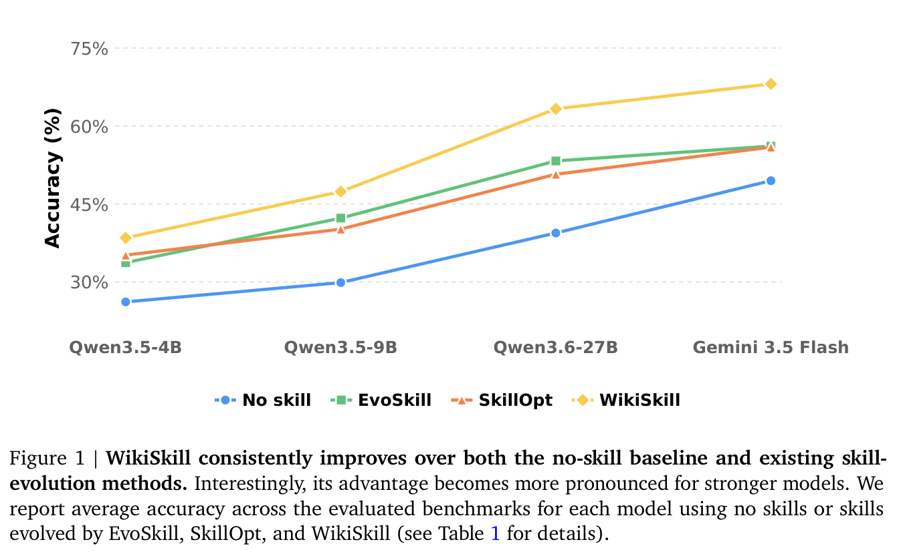
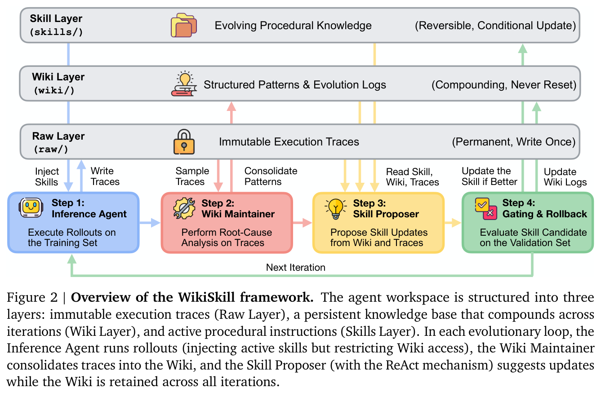
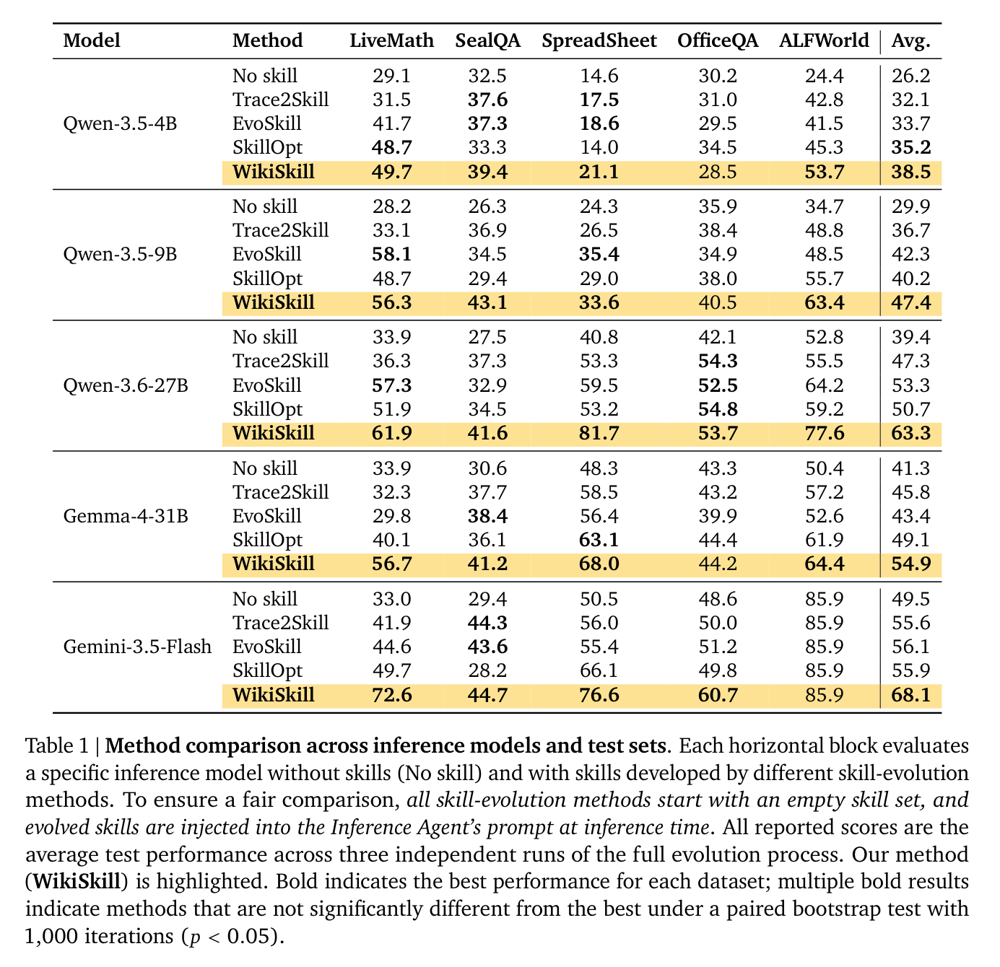
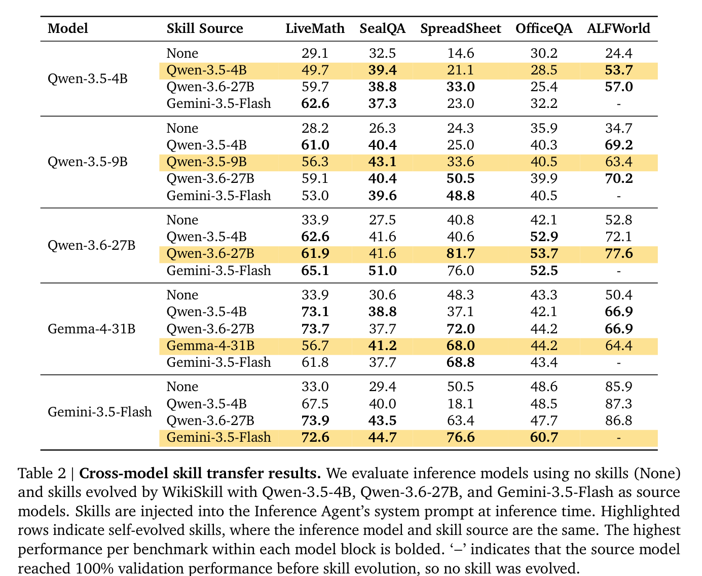
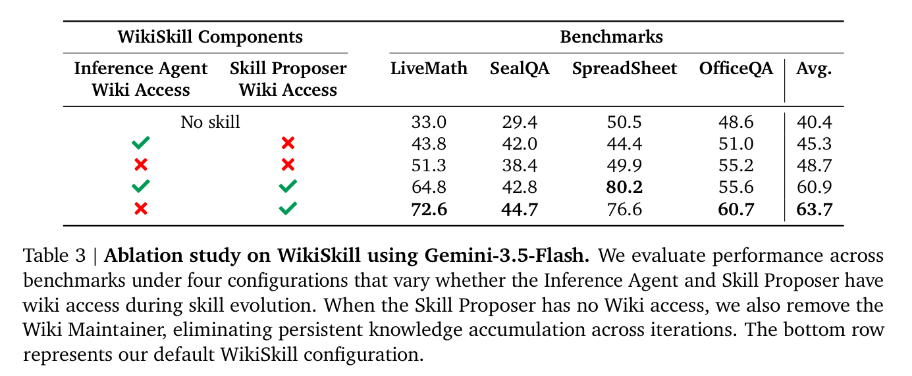
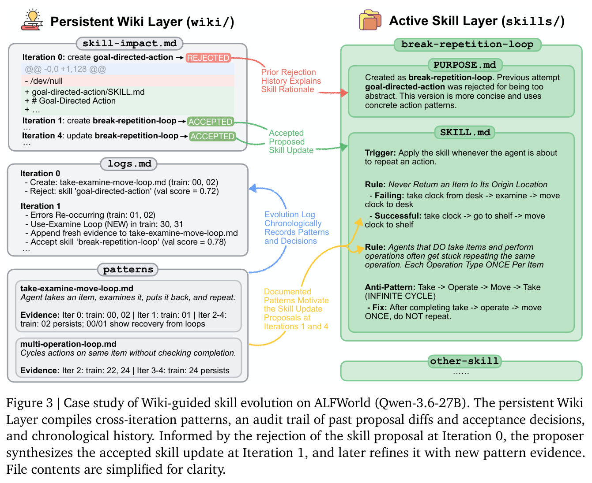
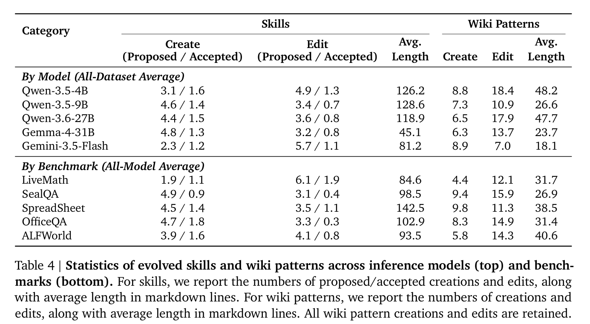

# 1. Introduction

---

**WikiSkill: Compiling Agent Experience into Persistent Knowledge for Skill Evolution** (Google Research & Virginia Tech, 2026)은 에이전트 스킬을 **지속되는 지식 베이스(wiki)와 함께 공진화(co-evolve)시키는** 프레임워크를 제안합니다.

Figure 1은 이 논문의 결론을 한 장으로 요약합니다. 가로축은 추론 모델을 능력 순으로 배치한 것(Qwen3.5-4B → Qwen3.5-9B → Qwen3.6-27B → Gemini 3.5 Flash), 세로축은 5개 벤치마크 평균 정확도입니다.

- **파란 선(No skill)**: 스킬 없이 그냥 푼 베이스라인. 모델이 커질수록 자연스럽게 올라갑니다.
- **초록/주황 선(EvoSkill, SkillOpt)**: 기존 스킬 진화 방법들. 베이스라인 위에 있기는 합니다. 다만 **두 선이 거의 붙어 있고 모델이 강해져도 베이스라인과의 간격이 크게 벌어지지 않습니다.**
- **노란 선(WikiSkill)**: 모든 구간에서 최상단이며 **오른쪽으로 갈수록 다른 선들과의 간격이 벌어집니다.**

→ **눈여겨볼 대목은 이 벌어지는 간격입니다. 스킬 진화가 모델 스케일링과 경쟁하는 게 아니라 보완한다는 뜻입니다. 강한 모델일수록 좋은 스킬에서 더 많은 것을 뽑아냅니다.**

### 1. 배경 및 문제 제기

에이전트 스킬(agent skill)은 모델 파라미터를 건드리지 않고 도메인 전문성을 담는 경량 포맷입니다. `SKILL.md` 한 파일에 frontmatter 메타데이터(이름, 설명)와 절차적 지침을 넣고 스크립트·리소스와 함께 디렉토리로 묶습니다. 감사 가능하고 재사용 가능하며, progressive disclosure(필요한 것만 로드)로 컨텍스트도 아낍니다.

문제는 **이 스킬을 누가 쓰느냐**입니다. 대부분 사람이 손으로 씁니다. 그러려면 에이전트가 앞으로 어떤 절차적 지식을 필요로 할지 미리 예측해야 하는데, 이건 애초에 어려운 일입니다.

그래서 최근 연구들은 스킬을 **자동으로 진화**시킵니다. 훈련 태스크에서 에이전트를 굴리고(rollout) 성공/실패 궤적을 분석한 뒤 그 경험으로 스킬을 고칩니다. EvoSkill, Trace2Skill, SkillOpt가 모두 이 계열입니다.

**그런데 여기에 공통된 구멍이 하나 있습니다.**

- EvoSkill은 과거 제안과 평가 결과의 누적 히스토리를 유지합니다.
- Trace2Skill은 궤적에서 교훈을 뽑아 스킬 업데이트에 녹입니다.
- SkillOpt는 거절된 편집 피드백과 epoch 단위 메타 지침을 씁니다.

→ **세 방법 모두 배운 것을 스킬 업데이트 과정 안에 흩뿌려 놓을 뿐, 별도로 진화하는 지식 표현으로 유지하지는 않습니다.** 통찰이 최적화 히스토리 여기저기에 흩어져 있으니 다음 iteration에서 체계적으로 재사용하기 어렵습니다.

### 2. 제안: WikiSkill

저자들은 Karpathy가 제안한 **LLM Wiki** 관점 — *경험을 지속적이고 복리로 쌓이는(compounding) 지식으로 컴파일하라* — 에서 출발해 이렇게 묻습니다.

> **에이전트의 경험도 지속 가능한 지식으로 컴파일해서, 장기적인 스킬 진화를 떠받칠 수 있을까?**

WikiSkill의 답은 **원시 경험(raw experience)과 실행 가능한 절차(skill) 사이에 구조화된 지식 레이어를 하나 끼워 넣는 것**입니다.

기존 방법은 이번 롤아웃을 보고 스킬을 고칩니다. WikiSkill은 이번 롤아웃을 **위키에 정리해 넣고** 그 누적된 위키를 보고 스킬을 고칩니다. 스킬은 검증에 실패하면 롤백되지만 **위키는 절대 롤백되지 않고 계속 쌓입니다.** 그래서 실패한 시도조차 자산이 됩니다. 이건 해봤는데 안 됐다는 기록이 영구히 남아 다음 제안이 같은 실수를 반복하지 않게 합니다.

### 3. 핵심 결과

- 5개 벤치마크 × 5개 모델에서 **모든 모델의 평균 성능 1위.** 각 모델별 최강 경쟁자 대비 +3.3 / +5.1 / +10.0 / +5.8 / +12.0점.
- **스킬 진화는 모델 스케일링을 보완합니다.** Qwen 계열에서 WikiSkill의 개선폭이 4B는 +12.3점, 9B는 +17.5점, 27B는 +23.9점으로 **모델이 클수록 커집니다.**
- 동시에 **작은 모델이 큰 모델을 이깁니다.** Qwen-3.5-9B + WikiSkill(47.4%)이 Qwen-3.6-27B 무스킬(39.4%)을 앞섭니다.
- **스킬은 모델 간 전이되며, 남의 스킬이 자기 스킬보다 나을 때가 있습니다.** ALFWorld에서 Qwen-3.5-9B는 자기가 만든 스킬로 63.4%인데, Qwen-3.6-27B가 만든 스킬을 쓰면 70.2%입니다.
- Ablation 결과, **위키를 제거하면 평균 63.7% → 48.7%로 15점 급락**합니다.

# 2. Method: 세 개의 레이어와 네 개의 에이전트

---

Figure 2가 WikiSkill의 전체 구조입니다. 위쪽 3개의 회색 막대가 **워크스페이스 레이어**, 아래쪽 4개의 컬러 박스가 **매 iteration마다 도는 루프**입니다.

## 2.1. 세 개의 지식 레이어

각 레이어에 붙은 괄호 문구가 그 레이어의 **수명 정책**을 정확히 말해줍니다.

**Raw Layer (`raw/`) — "Permanent, Write Once" (영구적, 한 번만 쓰기)**

훈련 롤아웃에서 나온 실행 궤적을 그대로 저장합니다. 추론 과정, 도구 호출, 도구 출력, 최종 답변까지 전부입니다. **불변(immutable)입니다** — 자물쇠 아이콘이 붙은 이유입니다. 원본 히스토리를 훼손 없이 보존해 Wiki Maintainer와 Skill Proposer가 언제든 원본으로 되돌아가 확인할 수 있게 합니다.

**Wiki Layer (`wiki/`) — "Compounding, Never Reset" (복리로 쌓이며, 절대 초기화 없음)**

이 논문의 핵심입니다. 원시 궤적을 **구조화된 지식으로 컴파일**해서 담습니다. 안에는 네 종류의 파일이 있습니다.

- `patterns/` — 개별 마크다운 파일 하나가 **하나의 실패 모드 또는 성공 전략**을 문서화합니다. 실행 가능한 우회책(workaround)까지 함께 적습니다.
- `index.md` — 패턴 카탈로그. 패턴이 바뀔 때마다 갱신됩니다.
- `logs.md` — **진화 로그.** Wiki Maintainer가 매 iteration의 발견을 시간순으로 덧붙입니다.
- `skill-impact.md` — **스킬 영향 추적기.** 검증 게이팅이 끝난 뒤 외부 하네스가 **프로그램적으로** 기록합니다. 제안 메타데이터, 대상 스킬 이름, 수정의 unified diff, 검증 점수, 최종 수락 여부까지.

이 기록들이 있어서 Wiki Maintainer와 Skill Proposer는 (1) 스킬 수락 히스토리 전체를 보고 **거절된 개입을 다시 제안하지 않고** (2) 과거에 뭘 제안했고 그게 통했는지 추적하고 (3) **어떤 오류가 iteration을 가로질러 반복되는지** 식별할 수 있습니다.

**Skills Layer (`skills/`) — "Reversible, Conditional Update" (되돌릴 수 있고, 조건부 업데이트)**

Inference Agent가 실제로 읽는 레이어입니다. 활성 스킬 집합이 여기 담기고, 각 스킬 디렉토리에는 두 파일이 들어갑니다.

- `SKILL.md` — 스킬 본문
- `PURPOSE.md` — **역추적 링크. 이 스킬이 어떤 위키 패턴에서 비롯됐는지 되짚습니다**

→ **`PURPOSE.md`가 Skill Layer와 Wiki Layer를 잇는 다리입니다. 스킬이 왜 이렇게 생겼는지를 동기가 된 패턴으로 설명할 수 있게 됩니다.**

## 2.2. 네 단계 진화 루프

**Step 1: Inference Agent — 현재 스킬로 훈련셋을 푼다**

활성 스킬 $S_{k-1}$을 **시스템 프롬프트에 전문 주입(full injection)** 하고 멀티턴 궤적을 생성합니다. 선행 연구를 따라 검색·트리거링 단계를 생략했습니다. 스킬 검색 실패가 실험의 교란 변수가 되는 것을 막기 위한 **의도적 설계**입니다. 이 논문은 스킬 검색이 아니라 스킬 품질 자체를 다룹니다.

여기서 눈여겨볼 점이 있습니다. Figure 2를 보면 Step 1에서 Skill Layer로는 파란 화살표가 오가지만 **Wiki Layer로는 화살표가 없습니다.** 훈련 롤아웃 중 Inference Agent는 **위키에 접근할 수 없습니다.** 왜 그런지는 5절 ablation에서 다룹니다.

**Step 2: Wiki Maintainer — 궤적을 위키로 압축한다**

$$W'_k \leftarrow \mathcal{M}_{WM}(W_{k-1}, \mathcal{T}_{\text{sample},k})$$

컨텍스트 한계를 피하기 위해 성공·실패 궤적을 층화 샘플링해서 받습니다. **실패 태스크에는 root cause analysis를, 성공 태스크에서는 전략 추출을** 수행합니다. 기존 위키 전체($W_{k-1}$)를 함께 받으므로 **새 패턴을 만들 수도, 기존 패턴에 새 증거를 덧붙일 수도** 있습니다. 패턴 수정은 append/replace/insert 같은 **incremental patch 방식**입니다 — 통째로 다시 쓰지 않습니다.

한 iteration에 만들 수 있는 패턴 수에 상한은 없습니다. Maintainer가 궤적과 현재 위키 상태를 보고 스스로 판단합니다.

**Step 3: Skill Proposer — 위키를 읽고 스킬 수정안을 낸다**

$$P_k \leftarrow \mathcal{M}_{P}(W'_k, S_{k-1}, \mathcal{T}_{\text{train},k})$$

여기가 가장 흥미로운 설계입니다. Proposer는 **미리 샘플링된 궤적 묶음을 받지 않습니다.** 긴 실행 히스토리를 통째로 넣으면 컨텍스트가 터지기 때문입니다.

대신 **ReAct 스타일 자율 에이전트**로 동작합니다. 처음에 받는 것은 세 가지뿐입니다 — 위키 인덱스 $I(W'_k)$, `skill-impact.md`, 그리고 훈련 태스크 결과 요약(pass/fail, 예측값, 정답). 그 다음 **스스로 추론하며 `read_file` 도구로 필요한 패턴 페이지와 원시 궤적을 골라서 열어봅니다.**

→ **모든 걸 다 보여주는 대신 목차를 주고 스스로 파고들게 하는 방식입니다. 인덱스가 있으니 필요한 곳만 깊게 볼 수 있습니다.**

한 iteration의 산출물은 **단일 스킬을 겨냥한 원자적 제안 $P_k$ 하나**입니다. 새 스킬 생성이거나 기존 스킬 하나에 대한 incremental patch입니다.

**Step 4: Gating & Rollback — 검증셋에서 나아졌을 때만 수락한다**

$$S_k \leftarrow \begin{cases} S'_k & \text{if } \mathcal{R}(\mathcal{T}_{\text{val},k}) > \mathcal{R}_{\text{best}} \\ S_{k-1} & \text{otherwise} \end{cases}$$

검증 점수가 **확실히 올랐을 때만** 수락합니다. 같으면 거절이고 스킬은 직전 상태로 롤백됩니다. $\mathcal{R}_{\text{best}}$의 초기값은 빈 스킬셋의 검증 점수입니다. 검증 점수가 1.0에 도달하면 진화 루프를 조기 종료합니다.

**결정적으로, 수락이든 거절이든 위키 $W_k$는 절대 롤백되지 않습니다.** 게이팅이 끝나면 하네스가 자동으로 `skill-impact.md`에 항목을 덧붙입니다.

$$W_k \leftarrow \text{Update}(W'_k, P_k, \mathcal{R}(\mathcal{T}_{\text{val},k}), a_k), \quad a_k \in \{\text{Accepted}, \text{Rejected}\}$$

→ **이게 바로 객관적 감사 추적(audit trail)입니다. LLM이 요약한 인상이 아니라 실제 diff와 실제 점수와 실제 판정이 그대로 남습니다. 다음 iteration의 Proposer는 이걸 읽고 실패한 수정을 반복하지 않습니다.**

# 3. Experiments: 얼마나, 그리고 왜 좋아지는가

---

**설정** — 5개 벤치마크(수학 추론 LiveMath, 웹 검색 SealQA, 스프레드시트 조작 SpreadSheet, 롱컨텍스트 문서 QA OfficeQA, 임바디드 상호작용 ALFWorld) × 5개 모델(Qwen-3.5-4B/9B, Qwen-3.6-27B, Gemma-4-31B, Gemini-3.5-Flash). 모든 방법은 **빈 스킬셋에서 시작**하고 전체 진화 과정을 **3회 독립 반복**한 평균입니다. 유의성은 paired bootstrap($p < 0.05$)으로 검정했습니다.

## 3.1. 메인 결과

Table 1은 모델별로 5개 블록으로 나뉘고 각 블록 안에서 무스킬(No skill) + 4개 스킬 진화 방법을 비교합니다. **노란 하이라이트 행이 WikiSkill**입니다.

**① 모든 모델에서 평균 1위입니다.** 맨 오른쪽 Avg. 열을 보면 노란 행이 각 블록의 최고값(38.5 / 47.4 / 63.3 / 54.9 / 68.1)을 차지합니다. 각 모델별 최강 경쟁자 대비 각각 +3.3, +5.1, +10.0, +5.8, +12.0점입니다.

**② 개선폭이 큽니다.** Gemini-3.5-Flash는 LiveMath에서 33.0% → **72.6%**(2배 이상), SpreadSheet에서 50.5% → **76.6%**. Qwen-3.6-27B는 ALFWorld에서 52.8% → **77.6%**, SpreadSheet에서 40.8% → **81.7%**(+40.9점)입니다.

**③ 기존 방법들은 가끔 오히려 깎아먹습니다.** 이 부분이 중요합니다.
- EvoSkill은 Qwen-9B의 LiveMath를 28.2% → 58.1%로 크게 올립니다. 그런데 **같은 벤치마크에서 Gemma-4-31B는 33.9% → 29.8%로 떨어뜨립니다.**
- SkillOpt도 Gemini-3.5-Flash의 SealQA를 29.4% → 28.2%로 **깎습니다.**

→ **WikiSkill은 더 강하기만 한 것이 아닙니다. 스킬을 붙였는데 오히려 나빠지는 사고가 훨씬 적어 더 안정적입니다.**

**④ 스킬 진화의 이득은 모델이 클수록 커집니다.** Qwen 계열의 평균 개선폭이 +12.3 → +17.5 → +23.9점으로 단조 증가합니다. SpreadSheet에서 특히 극적입니다: +6.5 / +9.3 / **+40.9**점.

동시에 **스킬은 모델 크기를 상당 부분 대체합니다.** Qwen-3.5-9B + WikiSkill = 47.4%가 Qwen-3.6-27B 무스킬 = 39.4%를 이깁니다.

> 💡 **모델 능력과 진화된 절차적 지식은 서로 대체재가 아니라 보완재입니다.** 강한 모델은 더 나은 스킬을 만들고 더 잘 실행해서 더 큰 이득을 얻습니다. 반대로 좋은 스킬은 작은 모델이 훨씬 큰 모델을 이기게 해줍니다.

**⑤ 벤치마크마다 스킬 진화의 효과가 다릅니다.** Qwen-3.6-27B 기준으로 OfficeQA +11.6, SealQA +14.1 vs. ALFWorld +24.8, LiveMath +28.0, SpreadSheet +40.9점입니다.

**LiveMath**는 다섯 모델 전부에서 +20.6~39.6점으로 일관되게 큰 이득을 봅니다. 반면 **OfficeQA**는 롱컨텍스트 문서 검색이라는 고유한 어려움 때문에 갈립니다 — 큰 모델은 진화된 검색 워크플로우를 잘 활용합니다(+11.6, +12.1점). 그런데 **Qwen-3.5-4B는 오히려 약간 하락합니다. 긴 컨텍스트 위에서 다단계 검색 절차를 실행하지 못하고 기본 읽기 행동으로 되돌아가버리기 때문입니다.**

## 3.2. 스킬은 모델을 건너 전이된다

Table 2는 **A 모델이 만든 스킬을 B 모델에 붙이면 어떻게 되는지**를 전면적으로 실험합니다. 각 블록은 추론 모델 하나이고 행은 스킬을 만든 소스 모델입니다. **노란 하이라이트가 자기 자신이 만든 스킬(self-evolved)** 입니다.

여기서 놀라운 패턴이 여러 개 나옵니다.

**① 전이된 스킬이 자기 스킬보다 나을 때가 많습니다.** Qwen-3.5-9B 블록을 보면 SpreadSheet에서 무스킬 24.3%, 자기 스킬 33.6%인데 **Qwen-3.6-27B 스킬을 빌려 쓰면 50.5%** 입니다. Gemma-4-31B의 LiveMath도 무스킬 33.9%, 자기 스킬 56.7%인데 **Qwen-3.6-27B 스킬로 73.7%** 입니다.

**② 작은 모델 → 큰 모델 전이도 통합니다.** Qwen-3.5-4B가 만든 스킬이 Gemma-4-31B를 LiveMath 73.1%, ALFWorld 66.9%로 끌어올립니다. 둘 다 Gemma의 자기 스킬(56.7%, 64.4%)보다 높습니다.

> 💡 **이 결과가 시사하는 바: 유용한 절차적 지식을 발견하는 능력과 그 지식을 실행하는 능력은 별개입니다.** 자기 진화(self-evolution)는 이 둘을 하나로 뭉뚱그리지만 실제로는 분리되어 있습니다. 4B 모델이 겪은 실패에서 나온 교훈이 31B 모델에게 유용할 수 있습니다.

**③ 하지만 음의 전이(negative transfer)도 존재합니다.** 가장 극적인 사례는 Gemini-3.5-Flash 블록의 SpreadSheet입니다 — 무스킬 50.5%인데 **Qwen-3.5-4B 스킬을 붙이면 18.1%로 폭락**하고 Qwen-3.6-27B 스킬을 붙이면 63.4%로 오릅니다.

저자들의 오류 분석은 두 가지 원인을 지목합니다.
- **저수준 우회책의 저주**: Qwen-3.5-4B 스킬은 한 줄짜리 Python 명령, 문자열 변환 규칙 같은 **미시적 워크어라운드**를 담고 있습니다. 작은 모델이 실행 실패를 피하는 데는 도움이 됩니다. 반면 **Gemini처럼 강한 모델이 포괄적인 end-to-end 스크립트를 짜는 것은 오히려 막습니다.**
- **예산 소진**: 파편화된 진단 절차가 중복 도구 호출을 유발해 태스크를 끝내기 전에 상호작용 예산을 다 써버립니다.

→ **전이 가능성은 스킬이 일반적 절차를 담았는지 모델별 임시방편을 담았는지에 달려 있습니다.** LiveMath 스킬은 전자에 가까워 잘 전이되고(Gemini를 33.0% → 67.5%/73.9%로), SpreadSheet 스킬은 후자가 섞여 소스-타깃 상호작용이 강합니다.

**④ 같은 스킬도 실행하는 모델에 따라 이득이 다릅니다.** Qwen-3.6-27B의 SpreadSheet 스킬은 4B/9B/27B를 각각 +18.4 / +26.2 / +40.9점 올립니다 — **똑같은 문서인데 강한 모델일수록 더 많이 뽑아냅니다.**

가장 재미있는 사례는 OfficeQA입니다. **Qwen-3.5-4B가 만든 스킬은 자기 성능은 30.2% → 28.5%로 떨어뜨립니다. 그런데 Qwen-3.6-27B는 42.1% → 52.9%로 올립니다.** 자기가 만든 걸 자기가 못 쓰는 겁니다. 궤적 분석에 따르면 작은 모델은 긴 문서 컨텍스트에 주의가 흐트러져 다단계 검색 지침을 따르지 못하고 기본 읽기 행동으로 회귀합니다.

# 4. Ablation: 위키가 정말 핵심인가

---

Table 3은 이 논문의 가설을 직접 겨냥한 실험입니다. Gemini-3.5-Flash로 **Inference Agent와 Skill Proposer 각각에 위키 접근 권한을 켜고 끄며** 네 가지 조합을 비교합니다. (Skill Proposer가 위키에 접근할 수 없으면 Wiki Maintainer도 함께 제거해 **iteration을 가로지르는 지식 축적 자체를 없앱니다.**)

체크(✔)는 접근 허용, X는 차단입니다. 맨 아래 행이 WikiSkill 기본 설정입니다.

| Inference Agent | Skill Proposer | Avg. |
| :---: | :---: | ---: |
| — (No skill) | — | 40.4 |
| ✔ | ✘ | 45.3 |
| ✘ | ✘ | 48.7 |
| ✔ | ✔ | 60.9 |
| **✘** | **✔** | **63.7** |

**① 지속되는 위키가 스킬 진화를 극적으로 개선합니다.** Inference Agent 접근을 끈 상태에서 Skill Proposer에게만 위키를 주면 **48.7% → 63.7% (+15.0점)** 입니다. LiveMath는 51.3% → 72.6%, SpreadSheet는 49.9% → 76.6%로 뜁니다.

→ **iteration을 가로질러 지식이 축적되지 않으면 Skill Proposer는 복잡한 실패 모드를 풀어내지 못합니다.** 매번 이번 롤아웃만 보고 처음부터 다시 진단해야 하기 때문입니다.

**② 반면 Inference Agent에게 위키를 주면 오히려 나빠집니다.** Skill Proposer가 위키를 가진 상태에서 Inference Agent에게도 위키를 주면 63.7% → 60.9%로 떨어집니다. LiveMath는 72.6% → 64.8%로 크게 하락합니다.

저자들의 가설은 이렇습니다. **훈련 롤아웃 중 에이전트가 스킬과 위키를 둘 다 볼 수 있으면 태스크 해결 지식의 일부를 스킬이 아니라 위키에서 직접 가져옵니다.** 그러면 그 궤적은 현재 스킬이 얼마나 부족한지를 제대로 드러내지 못하고 **스킬 개발에 덜 유익한 신호**가 됩니다.

> 💡 **직관적으로: 시험 볼 때 참고서를 통째로 들고 들어가면 시험 성적은 오르지만 이 학생이 무엇을 모르는지는 알 수 없게 됩니다.** WikiSkill이 훈련 롤아웃에서 위키를 일부러 차단하는 이유가 여기 있습니다. **깨끗한 실패 신호를 확보하기 위해서**입니다.

# 5. 실제로 무슨 일이 일어나는가: 케이스 스터디

---

Figure 3은 ALFWorld에서 Qwen-3.6-27B의 스킬이 실제로 진화하는 과정을 추적한 것입니다. 왼쪽이 **지속되는 Wiki Layer**, 오른쪽이 **활성 Skill Layer**이고 화살표가 둘 사이의 인과 관계입니다.

**Iteration 0 — 첫 시도, 그리고 거절**

Wiki Maintainer가 기본적인 루핑 행동을 발견해 `take-examine-move-loop.md` 패턴을 만듭니다. *"에이전트가 물건을 집고, 살펴보고, 다시 내려놓기를 반복한다."* Skill Proposer는 이를 보고 `goal-directed-action`이라는 스킬을 제안합니다. 결과는 — **검증 점수 0.72로 REJECTED입니다.**

여기서 보통의 방법이라면 이 실패는 사라집니다. 하지만 WikiSkill에서는 `skill-impact.md`에 **제안 diff와 거절 결과가 그대로 보존됩니다.** 그림 왼쪽 상단의 빨간 `REJECTED` 배지와 diff 블록(`+ goal-directed-action/SKILL.md`, `@@ -0,0 +1,128 @@`)이 그것입니다.

**Iteration 1 — 실패를 딛고 성공**

빨간 화살표 *"Prior Rejection History Explains Skill Rationale"* 가 핵심 경로입니다. Proposer는 감사 추적을 읽고 **왜 실패했는지**를 파악한 뒤 새 스킬 `break-repetition-loop`를 만듭니다. 그리고 이 판단이 오른쪽 `PURPOSE.md`에 그대로 기록됩니다.

> *"Created as `break-repetition-loop`. Previous attempt `goal-directed-action` was rejected for being **too abstract**. This version is **more concise and uses concrete action patterns**."*

→ **너무 추상적이었으니 구체적 행동 패턴으로 바꾸자는 판단입니다.** 이 메타 수준의 자기 교정이 가능한 이유는 오직 거절 기록이 남아 있기 때문입니다.

그래서 나온 규칙이 `SKILL.md`의 첫 번째 항목입니다.

> **Rule: Never Return an Item to Its Origin Location**
> - **Failing**: take clock from desk → examine → move clock to desk
> - **Successful**: take clock → go to shelf → move clock to shelf

추상적인 "목표 지향적으로 행동하라" 대신, **실패 궤적과 성공 궤적을 나란히 놓은 구체적 대조**입니다. 검증 점수 0.78로 **ACCEPTED.**

**Iteration 2~4 — 새 증거가 쌓이고, 스킬이 정교해진다**

롤아웃이 계속되면서 새로운 루프 변종이 나타납니다. Wiki Maintainer가 `multi-operation-loop.md`를 추가합니다 — *"완료 여부를 확인하지 않고 같은 물건에 대해 동작을 반복한다. Evidence: Iter 2: train 22, 24 | Iter 3-4: train 24 persists."*

**`Evidence:` 필드를 주목하세요.** 어느 iteration의 어느 훈련 태스크에서 이 패턴이 관찰됐는지, 그리고 **여전히 지속되는지(persists)** 를 추적합니다. `take-examine-move-loop.md`에는 *"Iter 2-4: train 02 persists; 00/01 show recovery from loops"* 라고 적혀 있습니다 — **어떤 케이스는 고쳐졌고 어떤 케이스는 안 고쳐졌는지까지 남습니다.**

노란 화살표 *"Documented Patterns Motivate the Skill Update Proposals at Iterations 1 and 4"* 를 따라, Iteration 4에서 Proposer가 스킬에 새 규칙을 덧붙입니다.

> **Rule: Each Operation Type ONCE Per Item**
> **Anti-Pattern**: Take → Operate → Move → Take (INFINITE CYCLE)
> **Fix**: After completing take → operate → move ONCE, do NOT repeat.

→ **하나의 스킬이 iteration 0의 실패, iteration 1의 성공, iteration 2~4의 새 증거를 층층이 흡수하며 자라납니다. 각 층은 위키에 영구히 남은 기록에서 나옵니다.**

## 5.1. 스킬과 위키는 어떻게 쌓이는가

Table 4는 진화 과정의 정량 통계입니다. `Create`와 `Edit` 열의 `제안 / 수락` 비율이 게이팅의 엄격함을 그대로 보여줍니다.

**① 게이트는 매우 엄격합니다.** 예를 들어 Qwen-3.5-4B는 스킬 생성을 3.1회 제안해 1.6회 수락, 편집을 4.9회 제안해 1.3회 수락합니다. **제안의 절반 이상이 버려지는 셈입니다.** 반면 **위키 패턴은 생성 8.8회, 편집 18.4회가 전부 유지됩니다** (캡션의 *"All wiki pattern creations and edits are retained"*).

→ **스킬은 좁은 문을 통과해야 합니다. 위키에는 문이 없습니다. 이 비대칭이 WikiSkill의 설계 철학입니다 — 실행되는 것은 엄격하게 검증하되 배운 것은 전부 남긴다.**

**② 모델마다 스킬 스타일이 다릅니다.** Qwen 계열은 긴 스킬(118.9~128.6줄)을 씁니다. Gemma-4-31B(45.1줄)와 Gemini-3.5-Flash(81.2줄)는 훨씬 간결합니다. Gemini는 특히 **생성보다 편집을 선호합니다** (create 2.3 vs. edit 5.7) — 새 스킬을 남발하기보다 기존 것을 다듬는 쪽입니다.

**③ 벤치마크가 스킬의 형태를 결정합니다.** SpreadSheet는 가장 긴 스킬(142.5줄)과 가장 많은 위키 패턴(9.8개)을 만들어냅니다. 반대로 LiveMath는 가장 짧은 스킬(84.6줄)과 가장 적은 패턴(4.4개)입니다. 스프레드시트 조작은 자잘한 절차적 함정이 많아 문서가 두꺼워지고, 수학 추론은 소수의 핵심 전략으로 압축된다는 뜻입니다. 그런데 Table 1에서 LiveMath의 개선폭이 가장 일관되게 컸다는 점을 떠올리면 — **분량이 아니라 밀도가 중요합니다.**

**④ 스킬 개선은 후반부까지 계속됩니다.** (Appendix Table 5) 수락된 업데이트 중 초기 단계(Iter 0~1)가 39~52%를 차지합니다. 나머지는 중반·후반에 흩어져 있습니다. SealQA는 특히 두드러져서 **중반 33%, 후반 28%** 입니다.

→ **초반에 다 배우고 끝나는 구조가 아닙니다. 위키에 증거가 쌓이면서 정제가 계속 일어난다는 증거입니다.**

# 6. 정리와 한계

---

### 이 논문이 보여준 것

1. **경험 → 지식 → 절차의 3단 분리가 작동합니다.** 원시 궤적과 실행 가능한 스킬 사이에 구조화된 지식 레이어를 끼워 넣는 것만으로 평균 15점이 오릅니다.
2. **롤백되지 않는 기록이 핵심입니다.** 특히 **거절된 제안의 diff와 점수**를 보존하는 것이 반복 실패를 막습니다.
3. **스킬 진화는 모델 스케일링과 경쟁하지 않고 보완합니다.** 강한 모델일수록 더 많이 얻고, 좋은 스킬은 두 세대 위 모델을 따라잡게 해줍니다.
4. **스킬 발견 능력과 스킬 실행 능력은 다른 능력입니다.** 그래서 남이 만든 스킬이 내 스킬보다 나을 수 있습니다.

### 저자들이 밝힌 한계

- **스킬 검색을 평가하지 않았습니다.** 스킬 품질을 격리하기 위해 전문을 프롬프트에 직접 주입했는데, 스킬 개수가 늘어나면 검색·트리거링이 실제 병목이 됩니다.
- **게이팅이 지나치게 엄격할 수 있습니다.** 검증 점수를 반드시 올려야 수락하므로 **당장은 성능이 같지만 다음 iteration의 발판이 될 중립적 제안**이 전부 버려집니다.
- **위키를 가지치기(prune)하는 메커니즘이 없습니다.** 패턴 페이지·로그·diff가 무한히 쌓이기만 합니다. 장기 진화에서는 필연적으로 문제가 됩니다.
- **초장기(long-horizon) 태스크를 다루지 않았습니다.** 수백 개의 환경 행동이나 몇 시간짜리 실행은 범위 밖입니다. **단일 롤아웃 안에서 절차적 지식을 실시간 갱신하는 online skill adaptation**은 향후 과제로 남았습니다.

> **한 줄 요약: 에이전트가 배운 것을 스킬에 직접 반영하지 말고, 일단 위키에 정리해 넣고 그 위키를 보고 스킬을 고쳐라. 스킬은 롤백되어도 위키는 남는다.**
