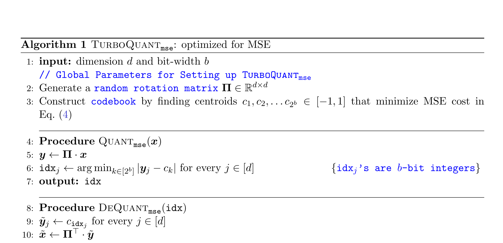
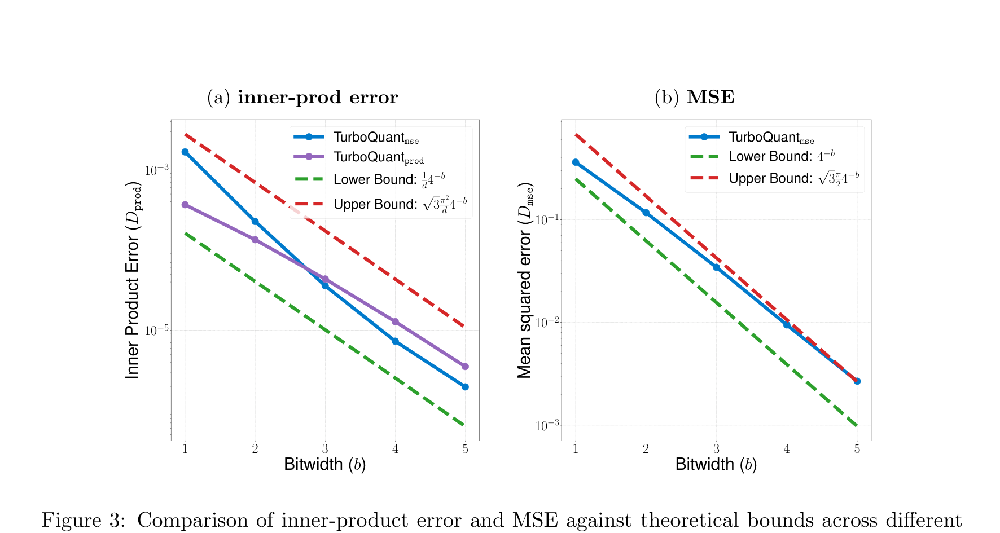
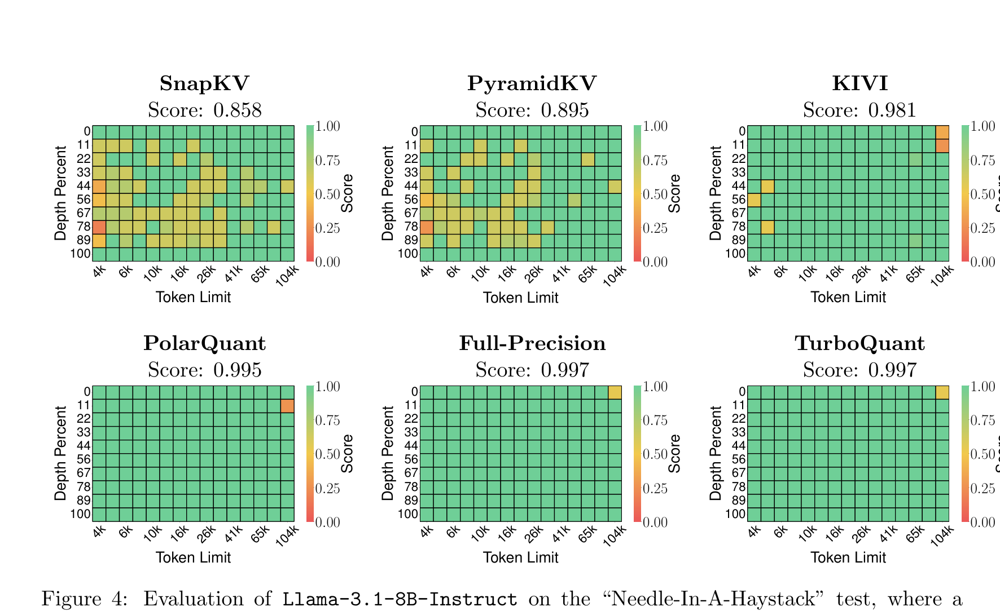
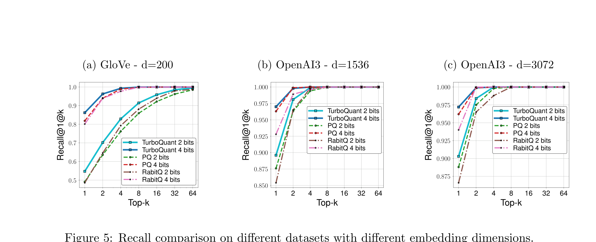

# 1. Introduction

---

### 1. 배경 및 문제 제기: 벡터 압축, 왜 '이론적 최적'이 중요한가

- **Vector Quantization (VQ)**은 고차원 벡터를 저비트 정수로 압축하면서, 원래 벡터 간의 기하학적 구조(내적, 거리)를 최대한 보존하는 기술입니다. Shannon의 Source Coding Theory에 뿌리를 둔 고전적 문제이지만, 오늘날 LLM 추론과 벡터 검색에서 **핵심 병목을 해소하는 실용 기술**로 부상했습니다.

- **KV Cache 문제:** Decoder 기반 Transformer는 이전 토큰들의 Key/Value 임베딩을 KV cache에 저장합니다. 이 캐시 크기는 모델 크기 × context 길이에 비례하므로, 긴 context를 처리할수록 **메모리와 지연 시간이 급격히 증가**합니다. KV cache를 압축하되 내적(Attention score 계산의 핵심)을 정확히 보존하는 것이 관건입니다.

    → **128k 토큰 context에서 KV cache가 수십 GB를 차지할 수 있으며, 이는 모델 가중치보다 클 수 있습니다.**

- **Nearest Neighbor Search:** 벡터 데이터베이스에서 내적/코사인 유사도 기반 검색은 RAG, 정보 검색의 기반입니다. Product Quantization (PQ)이 널리 쓰이지만, **k-means 기반 코드북 학습이 필요**하여 온라인 환경에 부적합하고, 인덱싱 시간이 오래 걸립니다.

- **기존 방법들의 공통 한계:**
  - **Data-dependent 방법** (GPTQ, AWQ 등): Hessian 정보 등 전처리가 필요 → 동적 데이터에 부적합
  - **KIVI 등 scalar quantization:** 이론적 최적성 보장이 없어, 낮은 비트폭에서 품질이 급락
  - **PQ:** 코드북 학습 필요, GPU 병렬화 어려움, 인덱싱 비용이 수백 초에 달함
  - 공통적으로, **"몇 비트까지 줄여도 안전한가?"에 대한 이론적 답이 없습니다.** 경험적으로 튜닝할 뿐입니다.

### 2. 제안: TurboQuant — 이론적 최적에 근접하는 온라인 벡터 양자화

TurboQuant의 핵심 아이디어는 놀라울 정도로 **단순하고 우아합니다:**

1. **Random Rotation:** 입력 벡터에 랜덤 회전 행렬을 곱합니다. 이렇게 하면 어떤 입력이든 각 좌표가 **Beta 분포**를 따르게 되고, 고차원에서는 가우시안에 수렴합니다.
2. **좌표 독립성 활용:** 고차원에서 회전된 벡터의 서로 다른 좌표는 거의 독립적이 됩니다. 따라서 **좌표별로 최적의 scalar quantizer를 독립 적용**해도 전체 벡터의 양자화가 near-optimal이 됩니다.
3. **Two-stage Inner Product Quantizer:** MSE-최적 양자화기는 내적 추정에 bias를 도입합니다. 이를 해결하기 위해 **(b-1)비트 MSE 양자화 + 1비트 QJL(Quantized Johnson-Lindenstrauss) 잔차 양자화**를 결합하여 **unbiased** 내적 추정기를 구성합니다.

→ **고차원 벡터에 랜덤 회전을 가하면 좌표별로 분리 가능해진다는 기하학적 성질을 이용하여, 복잡한 벡터 양자화 문제를 단순한 scalar 양자화의 반복으로 환원한 것이 TurboQuant의 핵심입니다.**

### 3. 핵심 결과

- **이론적 최적성:** TurboQuant의 MSE distortion은 정보이론적 하한 대비 **≈2.7배** 이내 (1비트에서는 1.45배까지 축소)
- **KV Cache 양자화:** 3.5비트에서 **full-precision과 완전히 동일한 품질**, 2.5비트에서도 미미한 품질 저하
- **Needle-in-a-Haystack:** 4배 이상 압축에도 full-precision과 **동일한 score (0.997)**
- **Nearest Neighbor Search:** PQ, RabitQ 대비 **더 높은 recall**, 인덱싱 시간은 사실상 **0초** (data-oblivious이므로)
- **완전 온라인:** 데이터 학습/캘리브레이션 불필요, 스트리밍 생성 중에도 즉시 적용 가능

# 2. TurboQuant: 알고리즘 설계

---

## 2.1 MSE-Optimal TurboQuant

TurboQuant의 MSE 최적화 알고리즘은 다음과 같이 동작합니다:

**알고리즘의 핵심 단계를 하나씩 살펴보겠습니다:**

**1단계 — 전역 설정 (한 번만 수행):**
- 랜덤 회전 행렬 $\Pi \in \mathbb{R}^{d \times d}$를 생성합니다. QR 분해를 통해 직교 행렬을 만듭니다.
- 목표 비트폭 $b$에 대해, Beta 분포의 **최적 centroid** $c_1, c_2, \ldots, c_{2^b}$를 사전 계산합니다. 이 centroid들은 연속 1차원 k-means(Lloyd-Max 알고리즘)를 풀어 얻습니다.

> 이 사전 계산은 입력 데이터와 무관합니다. Beta 분포의 최적 codebook은 비트폭별로 한 번만 구하면 되며, 이후 모든 벡터에 동일하게 적용됩니다. 이것이 "data-oblivious"의 핵심입니다.

**2단계 — 양자화 (Quant):**
- 입력 벡터 $x$에 회전 행렬을 곱합니다: $y = \Pi \cdot x$
- 회전된 벡터의 각 좌표 $y_j$에 대해, 가장 가까운 centroid의 인덱스를 저장합니다 (b-bit 정수)

**3단계 — 역양자화 (DeQuant):**
- 저장된 인덱스로부터 centroid 값을 복원합니다: $\hat{y}_j = c_{\text{idx}_j}$
- 역회전을 적용합니다: $\hat{x} = \Pi^{-1} \cdot \hat{y}$

**왜 이것이 near-optimal인가?**

핵심은 **Lemma 1**에 있습니다: 단위 구 위의 임의의 벡터 $x$에 랜덤 회전 $\Pi$를 적용하면, 결과 벡터 $\Pi \cdot x$는 단위 구 위에 균일 분포합니다. 이때 각 좌표는 Beta 분포 $f_X(x) = \frac{\Gamma(d/2)}{\sqrt{\pi} \cdot \Gamma((d-1)/2)} (1-x^2)^{(d-3)/2}$를 따릅니다. 고차원에서 이 분포는 $N(0, 1/d)$에 수렴하며, **서로 다른 좌표들은 거의 독립적**이 됩니다.

→ **좌표 간 독립성 덕분에, 각 좌표에 독립적으로 scalar quantizer를 적용해도 벡터 전체의 MSE가 최적에 가깝습니다.** 이는 마치 고차원에서 "차원의 저주"가 오히려 우리에게 유리하게 작용하는 셈입니다.

**Theorem 1 (MSE 상한):** 비트폭 $b$에서 TurboQuant의 MSE distortion은:

$$D_{\text{mse}} \leq \frac{\sqrt{3}\pi}{2} \cdot \frac{1}{4^b}$$

구체적인 수치로는 $b = 1, 2, 3, 4$일 때 각각 약 $0.36, 0.117, 0.03, 0.009$입니다.

## 2.2 Inner Product TurboQuant: Two-Stage 접근

MSE-최적 양자화기는 내적 추정에 **bias**를 도입합니다. 비트폭이 낮을수록 bias가 커지며, 이는 Attention score 계산에 체계적인 오류를 만들어 KV cache 양자화에 치명적입니다.

TurboQuant의 해법은 **two-stage 구조**입니다:

1. **(b-1)비트 MSE 양자화:** 먼저 목표 비트폭보다 1비트 적게 MSE-최적 양자화를 적용합니다. 이렇게 하면 잔차(residual) $r = x - \hat{x}_{\text{mse}}$의 L2 norm이 최소화됩니다.
2. **1비트 QJL 잔차 양자화:** 잔차에 QJL(Quantized Johnson-Lindenstrauss) 변환을 적용합니다. QJL은 랜덤 행렬 $S$의 부호(sign)만 저장하는 1비트 양자화로, **unbiased** 내적 추정을 보장합니다.

> QJL의 직관: 랜덤 프로젝션 $S \cdot x$의 부호만 저장하고, 역변환 시 $\sqrt{\pi/2}/d \cdot S^\top \cdot z$를 계산합니다. Johnson-Lindenstrauss Lemma의 양자화 버전으로, 1비트만으로 내적의 unbiased 추정이 가능합니다.

**Theorem 2 (Inner Product 상한):** 비트폭 $b$에서 TurboQuant의 내적 distortion은:

$$D_{\text{prod}} \leq \frac{\sqrt{3}\pi^2 \cdot \|y\|_2^2}{d} \cdot \frac{1}{4^b}$$

핵심은 내적 추정이 **unbiased**라는 점입니다: $E[\langle y, Q^{-1}(Q(x)) \rangle] = \langle y, x \rangle$

## 2.3 정보이론적 하한: TurboQuant은 얼마나 최적에 가까운가?

**Theorem 3**은 Shannon's Lower Bound와 Yao's Minimax Principle을 결합하여, **어떤 양자화 알고리즘이든** 달성할 수 있는 최소 distortion의 하한을 증명합니다:

$$D_{\text{mse}} \geq \frac{1}{4^b}, \qquad D_{\text{prod}} \geq \frac{\|y\|_2^2}{d} \cdot \frac{1}{4^b}$$

TurboQuant의 상한과 비교하면:

| Metric | TurboQuant 상한 | 정보이론적 하한 | Gap |
|---|---|---|---|
| MSE | $\frac{\sqrt{3}\pi}{2} \cdot 4^{-b}$ | $4^{-b}$ | $\approx 2.7\times$ |
| Inner Product | $\frac{\sqrt{3}\pi^2}{d} \cdot 4^{-b}$ | $\frac{1}{d} \cdot 4^{-b}$ | $\approx 2.7\times$ |

→ **TurboQuant은 정보이론적 한계 대비 상수배(≈2.7) 이내의 distortion을 달성합니다. 비트폭이 낮을수록 이 gap은 더 줄어들어, 1비트에서는 약 1.45배까지 접근합니다.**

# 3. Experiments

---

## 3.1 이론적 예측 검증

위 그래프는 TurboQuant의 실측 distortion을 이론적 상한/하한과 비교한 것입니다. DBpedia 데이터셋(OpenAI 임베딩, 1536차원)에서 측정했습니다.

**(a) Inner Product Error:**
- 가로축은 비트폭(1~5), 세로축은 내적 distortion $D_{\text{prod}}$ (로그 스케일)입니다.
- **파란 실선 (TurboQuant$_{\text{mse}}$):** MSE-최적 양자화기를 내적 추정에 사용한 경우. 낮은 비트폭에서 bias로 인해 distortion이 높습니다.
- **보라 실선 (TurboQuant$_{\text{prod}}$):** Two-stage 내적 양자화기. 모든 비트폭에서 더 낮은 distortion을 보이며, 특히 **1~2비트에서 현저한 차이**를 보입니다.
- **녹색 점선 (Lower Bound):** 정보이론적 하한. TurboQuant$_{\text{prod}}$가 이 하한에 매우 가깝게 따라갑니다.
- **빨간 점선 (Upper Bound):** Theorem 2의 이론적 상한. 실측값이 상한 아래에 잘 들어옵니다.

**(b) MSE:**
- TurboQuant$_{\text{mse}}$의 실측 MSE가 이론적 상한과 하한 사이에 정확히 위치합니다.
- 비트폭이 증가할수록 distortion이 **지수적으로 감소**하며 ($4^{-b}$ 비율), 이론 예측과 정확히 일치합니다.

→ **이론적 분석이 실제 데이터에서도 정확히 검증되었습니다. TurboQuant은 "이론적으로 최적에 가깝다"는 주장을 실험으로 뒷받침합니다.**

## 3.2 KV Cache 양자화: Needle-in-a-Haystack

이 실험은 Llama-3.1-8B-Instruct 모델에서, 긴 문서 속에 숨겨진 문장을 정확히 찾아내는 **Needle-in-a-Haystack** 테스트 결과입니다. 모든 방법은 **메모리 압축 비율 0.25** (즉, KV cache를 25%만 사용)로 평가되었습니다.

**각 히트맵의 의미:**
- 가로축은 입력 시퀀스 길이(4k~104k 토큰), 세로축은 "needle"이 삽입된 위치(문서의 0%~100% 깊이)입니다.
- 녹색은 성공적 검색(score 1.0), 빨간색/노란색은 실패를 나타냅니다.

**방법별 비교:**
- **SnapKV (Score: 0.858):** 토큰 수준 압축으로, 긴 시퀀스와 깊은 위치에서 심각한 검색 실패(빨간 영역)가 발생합니다.
- **PyramidKV (Score: 0.895):** SnapKV보다 개선되었으나 여전히 곳곳에 노란/빨간 영역이 존재합니다.
- **KIVI (Score: 0.981):** Scalar quantization 방식으로 대부분 성공하지만, 이론적 보장이 없어 일부 영역에서 미세한 실패가 관찰됩니다.
- **PolarQuant (Score: 0.995):** 극좌표 변환 기반 양자화로, 거의 완벽하지만 0.997에는 미치지 못합니다.
- **Full-Precision (Score: 0.997):** 압축 없는 원본 모델의 성능 기준선입니다.
- **TurboQuant (Score: 0.997):** **4배 이상 압축에도 불구하고 full-precision과 완전히 동일한 점수**를 달성합니다. 히트맵이 전면 녹색으로, 어떤 시퀀스 길이/깊이 조합에서도 실패가 없습니다.

→ **TurboQuant은 4배 압축 상태에서도 원본과 동일한 검색 정확도를 유지하는 유일한 방법입니다. 이는 이론적 최적성 보장이 실질적인 품질 차이로 이어짐을 보여줍니다.**

## 3.3 KV Cache 양자화: LongBench 종합 평가

LongBench-E 벤치마크에서의 종합적인 end-to-end 평가 결과입니다. 다양한 long-context 태스크(QA, 요약, few-shot, 합성 태스크, 코드 완성)를 포함합니다.

| Method | KV Size (bits) | SingleQA | MultiQA | Summarization | Few-shot | Synthetic | Code | **Average** |
|---|---|---|---|---|---|---|---|---|
| Full Cache | 16 | 45.29 | 45.16 | 26.55 | 68.38 | 59.54 | 46.28 | **50.06** |
| KIVI | 3 | 43.38 | 37.99 | 27.16 | 68.38 | 59.50 | 44.68 | 48.50 |
| KIVI | 5 | 45.04 | 45.70 | 26.47 | 68.57 | 59.55 | 46.41 | 50.16 |
| PolarQuant | 3.9 | 45.18 | 44.48 | 26.23 | 68.25 | 60.07 | 45.24 | 49.78 |
| **TurboQuant** | **2.5** | 44.16 | 44.96 | 24.80 | 68.01 | 59.65 | 45.76 | **49.44** |
| **TurboQuant** | **3.5** | 45.01 | 45.31 | 26.00 | 68.63 | 59.95 | 46.17 | **50.06** |

**핵심 발견:**

- **TurboQuant 3.5비트 = Full Cache 16비트:** 평균 50.06으로 **완전히 동일한 점수**를 달성합니다. 이는 **4.5배 이상 압축**에 해당합니다.
- **TurboQuant 2.5비트도 49.44:** KIVI 3비트(48.50)보다 **더 적은 비트로 더 높은 성능**을 달성합니다.
- **스트리밍 양자화:** 기존 KIVI, PolarQuant은 생성된 토큰은 양자화하지 않지만, TurboQuant은 **생성 과정 중에도 양자화를 적용**합니다. 즉, 더 공격적인 압축 조건에서도 우수한 성능을 보입니다.

> 2.5비트와 3.5비트 같은 비정수 비트폭은, 채널을 outlier/non-outlier 그룹으로 나누어 각각 다른 비트폭의 TurboQuant을 적용한 결과입니다. 예를 들어 2.5비트 설정에서는 32개 outlier 채널에 3비트, 나머지 96개 채널에 2비트를 할당합니다: $(32 \times 3 + 96 \times 2) / 128 = 2.5$.

## 3.4 Nearest Neighbor Search

위 그래프는 세 가지 데이터셋에서 TurboQuant, Product Quantization (PQ), RabitQ의 **recall@1@k** (상위 k개 결과에 진짜 최근접 이웃이 포함될 확률)을 비교합니다.

**(a) GloVe (d=200):**
- 저차원 데이터에서 방법 간 차이가 가장 큽니다.
- **TurboQuant 4비트**(분홍)가 모든 k에서 최고 recall을 달성하며, **PQ 4비트**(파란 점선)와의 격차가 특히 k=1에서 뚜렷합니다.
- 2비트에서도 TurboQuant이 PQ, RabitQ 모두를 상회합니다.

**(b) OpenAI3 (d=1536):**
- 고차원에서는 전반적으로 recall이 높아지지만, TurboQuant이 여전히 **모든 비트폭에서 최고 성능**을 유지합니다.
- 특히 2비트에서 PQ 대비 recall 격차가 더 벌어집니다.

**(c) OpenAI3 (d=3072):**
- 가장 고차원에서도 동일한 패턴이 유지됩니다. TurboQuant 2비트가 PQ 4비트와 비슷한 수준의 recall을 달성합니다.

**인덱싱 시간 비교:**

| 방법 | d=200 | d=1536 | d=3072 |
|---|---|---|---|
| Product Quantization | 37.04초 | 239.75초 | 494.42초 |
| RabitQ | 597.25초 | 2267.59초 | 3957.19초 |
| **TurboQuant** | **0.0007초** | **0.0013초** | **0.0021초** |

→ **TurboQuant의 인덱싱 시간은 사실상 0입니다.** Data-oblivious 특성 덕분에 k-means 학습이나 데이터 적응이 필요 없기 때문입니다. PQ 대비 **10만~20만 배 빠른 인덱싱**이면서도 recall은 더 높습니다. 실시간으로 벡터가 추가되는 온라인 환경(예: RAG 파이프라인에서 새 문서가 지속적으로 인덱싱되는 경우)에서 결정적인 장점입니다.
